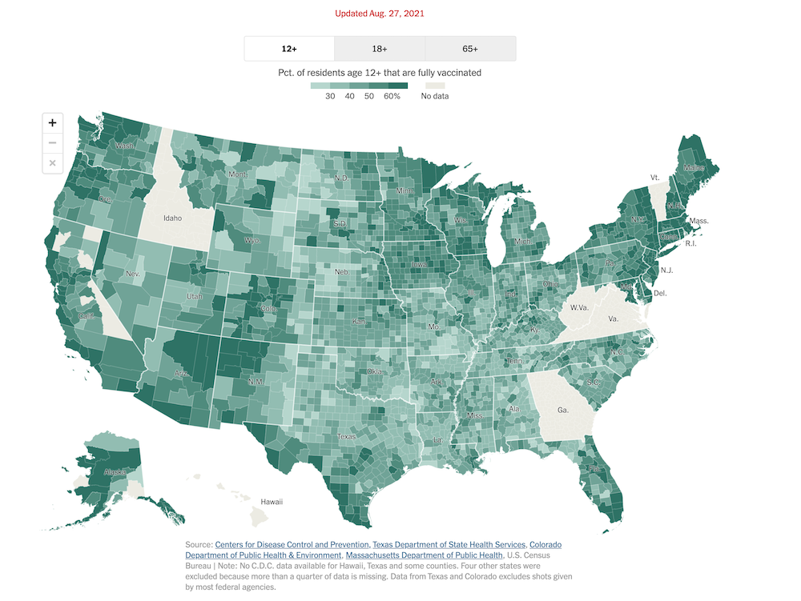
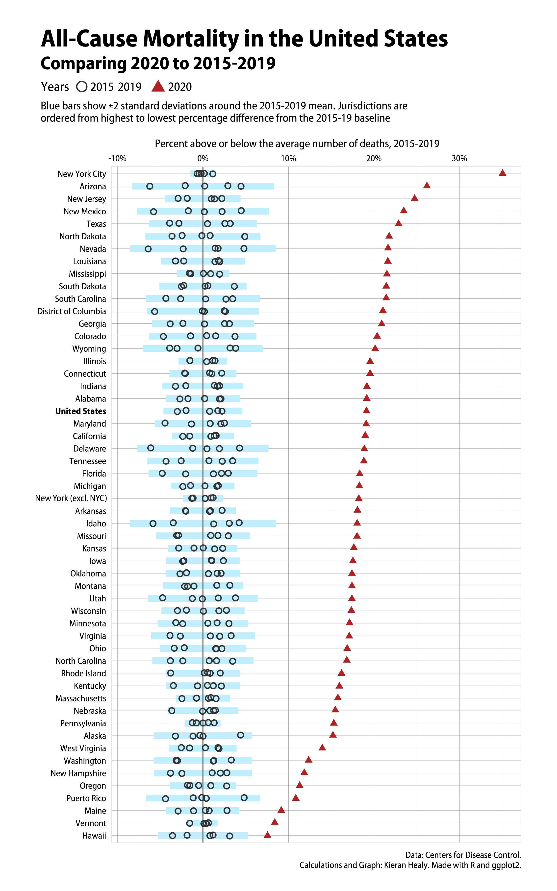
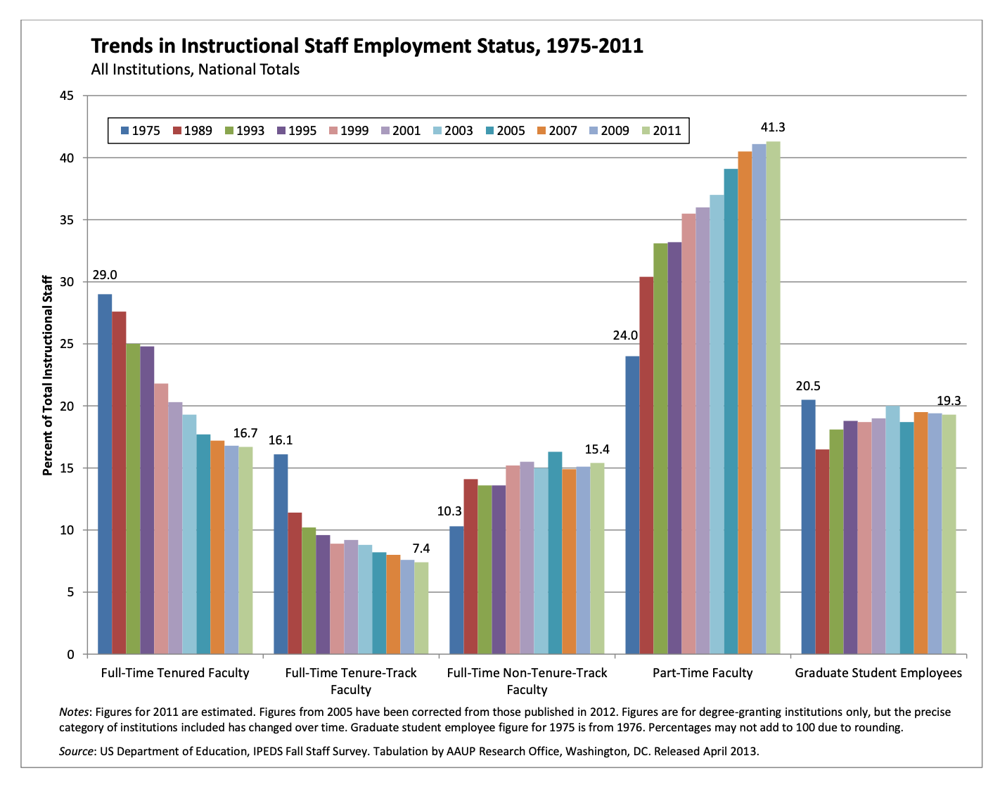
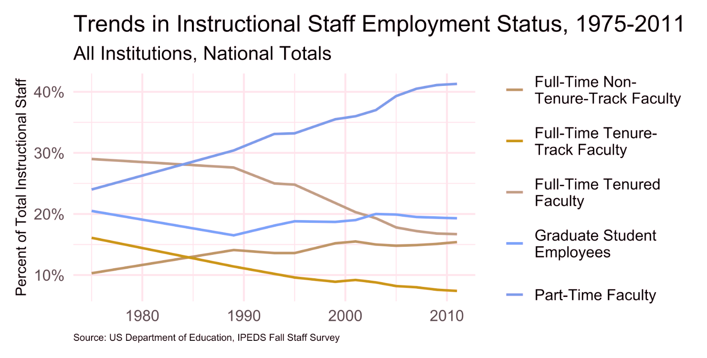
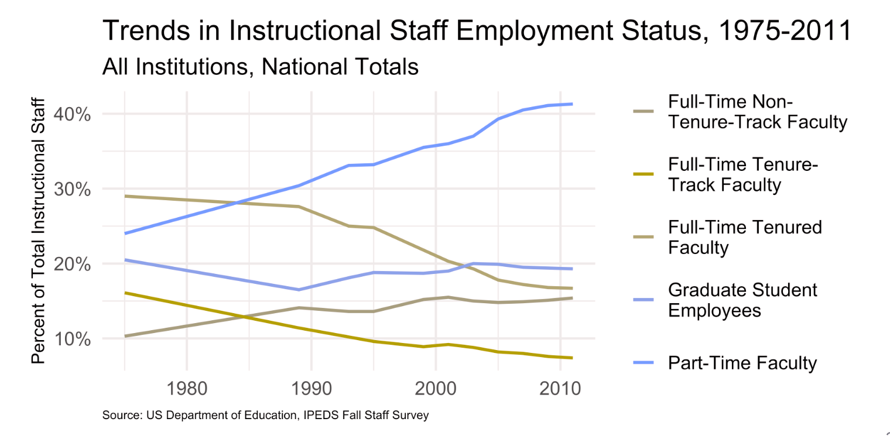

```{r setup, include=FALSE}
options(htmltools.dir.version = FALSE)
knitr::opts_chunk$set(
  fig.width = 8, fig.asp = 0.518, fig.retina = 3, dpi = 300,
  out.width = "100%",
  cache = FALSE,
  echo = FALSE,
  message = FALSE, 
  warning = FALSE,
  hiline = TRUE
)
```

```{r xaringan-themer, include = FALSE, warning = FALSE}
library(xaringanthemer)
style_duo_accent(
  primary_color = "#468189",
  secondary_color = "#9DBEBB",
  inverse_header_color = "#F4E9CD",
  black_color = "#031926",
  code_highlight_color = "#F4E9CD",
  header_font_google = google_font("Atkinson Hyperlegible"),
  text_font_google   = google_font("Atkinson Hyperlegible", "300", "300i"),
  code_font_google   = google_font("Source Code Pro"),
  code_font_size = "24px",
  title_slide_background_color = "#9DBEBB",
  title_slide_text_color = "#F4E9CD",
  base_font_size = "24px",
  header_h1_font_size = "2.5rem",
  header_h2_font_size = "2rem",
  header_h3_font_size = "1.75rem",
  extra_css = list(
    "h1" = list("margin-block-start" = "0.4rem", 
                 "margin-block-end" = "0.4rem"),
    "h2" = list("margin-block-start" = "0.4rem", 
                 "margin-block-end" = "0.4rem"),
    "h3" = list("margin-block-start" = "0.4rem", 
                 "margin-block-end" = "0.4rem"),
    ".small" = list("font-size" = "90%"),
    ".midi" = list("font-size" = "85%"),
    ".larger" = list("font-size" = "150%"),
    ".large" = list("font-size" = "200%"),
    ".xlarge" = list("font-size" = "600%"),
    ".hand" = list("font-family" = "'Gochi Hand', cursive",
                   "font-size" = "125%"),
    ".task" = list("padding-right"    = "10px",
                   "padding-left"     = "10px",
                   "padding-top"      = "3px",
                   "padding-bottom"   = "3px",
                   "margin-bottom"    = "6px",
                   "margin-top"       = "6px",
                   "border-left"      = "solid 5px #468189",
                   "background-color" = "#9DBEBB"),
    ".pull-left" = list("width" = "49%",
                        "float" = "left"),
    ".pull-right" = list("width" = "49%",
                         "float" = "right"),
    ".pull-left-wide" = list("width" = "70%",
                             "float" = "left"),
    ".pull-right-narrow" = list("width" = "27%",
                                "float" = "right"),
    ".pull-left-narrow" = list("width" = "27%",
                               "float" = "left"),
    ".pull-right-wide" = list("width" = "70%",
                              "float" = "right") 
    )
  )
```

```{r include = FALSE}
library(tidyverse)
library(datasauRus)
library(knitr)
library(colorblindr)
library(scales)
library(gt)
library(coronavirus) # devtools::install_github("RamiKrispin/coronavirus")
library(lubridate)
library(glue)
library(scales)
library(ggrepel)
library(patchwork)
xaringanExtra::use_panelset()
ggplot2::theme_set(ggplot2::theme_minimal(base_size = 16))
set.seed(1234)
```

class: middle, inverse

# 🔗 [bit.ly/dataviz-enar-2022](https://bit.ly/dataviz-enar-2022)

To follow along with the exercises, open and make a permanent copy of the RStudio Cloud project at https://rstudio.cloud/project/3796661.

---

class: middle, inverse

# .hand[why] visualize

---

class: middle

> *"The simple graph has brought more information to the data analyst's mind than any other device."*
>
>John Tukey

---

class: middle, larger

.hand[We visualize data to ...]

- discover patterns that may not be obvious from numerical summaries

---

```{r}
datasaurus_dozen <- datasaurus_dozen %>%
  mutate(dataset = case_when(
    dataset == "dino"       ~ "Dataset 1",
    dataset == "away"       ~ "Dataset 2",
    dataset == "h_lines"    ~ "Dataset 3",
    dataset == "v_lines"    ~ "Dataset 4",
    dataset == "x_shape"    ~ "Dataset 5",
    dataset == "star"       ~ "Dataset 6",
    dataset == "high_lines" ~ "Dataset 7",
    dataset == "dots"       ~ "Dataset 8",
    dataset == "circle"     ~ "Dataset 9",
    dataset == "bullseye"   ~ "Dataset 10",
    dataset == "slant_up"   ~ "Dataset 11",
    dataset == "slant_down" ~ "Dataset 12",
    dataset == "wide_lines" ~ "Dataset 13"
  ),
  dataset = fct_relevel(dataset, "Dataset 1", "Dataset 2", "Dataset 3", "Dataset 4", "Dataset 5", "Dataset 6", "Dataset 7", "Dataset 8", "Dataset 9", "Dataset 10", "Dataset 11", "Dataset 12", "Dataset 13")
  )
```

.pull-left-narrow[
.task[
We have 13 datasets, each with 142 observations. For each observation we have values on two variables recorded: an X and a Y.

Summary statistics for these two variables for each of the datasets is given on the right. 

How, if at all, are these 13 datasets different from each other?
]
]
.pull-right-wide[
```{r}
datasaurus_dozen %>%
  group_by(dataset) %>%
  summarise(
    n = n(),
    `Average x` = round(mean(x), 1),
    `Average y` = round(mean(y), 1)
  ) %>%
  kable()
```
]

---

.pull-left-narrow[
.task[
Some more summary statistics...

How, if at all, are these 13 datasets different from each other?
]
]
.pull-right-wide[
```{r}
datasaurus_dozen %>%
  group_by(dataset) %>%
  summarise(
    n = n(),
    `Average x` = round(mean(x), 1),
    `Average y` = round(mean(y), 1),
    `St Dev x` = round(sd(x), 1),
    `St Dev y` = round(sd(y), 1)
  ) %>%
  kable()
```
]

---

.pull-left-narrow[
.task[
And some more summary statistics...

How, if at all, are these 13 datasets different from each other?
]
]
.pull-right-wide[
```{r}
datasaurus_dozen %>%
  group_by(dataset) %>%
  summarise(
    n = n(),
    `Average x` = round(mean(x), 1),
    `Average y` = round(mean(y), 1),
    `St Dev x` = round(sd(x), 1),
    `St Dev y` = round(sd(y), 1),
    `Correlation` = round(cor(x, y), 1)
  ) %>%
  kable()
```
]

---

.pull-left-narrow[
.task[
And finally a visualization!

How, if at all, are these 13 datasets different from each other?
]
]
.pull-right-wide[
```{r fig.asp = 0.8, out.width = "100%"}
datasaurus_dozen %>%
  ggplot(aes(x = x, y = y, color = dataset)) +
  geom_point(show.legend = FALSE) +
  facet_wrap(~dataset) +
  scale_color_viridis_d()
```
]

---

class: middle, larger

.hand[We visualize data to ...]

- discover patterns that may not be obvious from numerical summaries

- convey information in a way that is otherwise difficult/impossible to convey

---

.pull-left-narrow[
.task[
Describe, in words, what this visualization shows.
]

.small[
Source: [Financial Times](https://www.ft.com/content/a2901ce8-5eb7-4633-b89c-cbdf5b386938), 27 Aug 2021.
]
]
.pull-right-wide[
```{r out.width = "100%"}
knitr::include_graphics("images/ft-covid-excess-deaths.png")
```
]

---

.pull-left-narrow[
.task[
Describe, in words, what this visualization shows.
]

.small[
Source: [New York Times](https://www.nytimes.com/interactive/2020/us/covid-19-vaccine-doses.html), 27 Aug 2021.
]
]
.pull-right-wide[
```{r out.width = "100%"}

```
]

---

.pull-left-narrow[
.task[
Describe, in words, what this visualization shows.
]

.small[
Source: Kieran Healy - [Excess Deaths in 2020](https://kieranhealy.org/blog/archives/2021/10/21/excess-deaths-in-2020/), 21 Oct 2021.
]
]
.pull-right-wide[
```{r out.width = "50%", fig.align = "center"}

```
]

---

class: middle, inverse

# .hand[how] visualize

## and .hand[how not]

---

class: middle

## Case study 1: 

## Trends instructional staff employees in universities

---

The American Association of University Professors (AAUP) is a nonprofit membership association of faculty and other academic professionals. 
[This report](https://www.aaup.org/sites/default/files/files/AAUP_Report_InstrStaff-75-11_apr2013.pdf) by the AAUP shows trends in instructional staff employees between 1975 and 2011, and contains the following image.

.pull-left-narrow[
.task[
What trends are apparent in the visualization on the right?
]
]
.pull-right-wide[
```{r out.width = "85%", fig.align = "center"}

```
]

---

## Data

Each row in this dataset represents a faculty type, and the columns are the years for which we have data. 
The values are percentage of hires of that type of faculty for each year.

```{r load-data-staff, message=FALSE}
staff <- read_csv("data/instructional-staff.csv")
staff %>%
  rename(`Faculty type` = faculty_type) %>%
  kable()
```

---

## Recreate

```{r}
staff_long <- staff %>%
  pivot_longer(cols = -faculty_type, names_to = "year", 
               values_to = "percentage") %>%
  mutate(
    percentage = as.numeric(percentage),
    faculty_type = fct_relevel(faculty_type,
                               "Full-Time Tenured Faculty",
                               "Full-Time Tenure-Track Faculty",
                               "Full-Time Non-Tenure-Track Faculty",
                               "Part-Time Faculty",
                               "Graduate Student Employees")
    )
```


```{r fig.asp = 0.5, fig.with = 12}
str_wrap_factor <- function(x, ...) {
  levels(x) <- str_wrap(levels(x), ...)
  x
}

staff_long %>%
  ggplot(aes(x = str_wrap_factor(faculty_type, 20), 
             y = percentage, 
             fill = year)) +
  geom_col(position = "dodge") +
  scale_y_continuous(breaks = seq(5, 45, 5), limits = c(0, 45)) +
  labs(x = NULL, 
       y = "Percent of Total Instructional Staff", 
       fill = NULL,
       title = "Trends in Instructional Staff Employment Status, 1975-2011",
       subtitle = "All Institutions, National Totals",
       caption = "Source: US Department of Education, IPEDS Fall Staff Survey"
       ) +
  theme(
    axis.text = element_text(size = 10),
    axis.title.y = element_text(size = 12),
    legend.position = c(0.4, 0.93),
    legend.direction = "horizontal",
    legend.key.size = unit(0.2, "cm"),
    legend.key.height = unit(0.1, "cm"),
    legend.text.align = 0,
    legend.background = element_rect(color = "black", size = 0.2),
    legend.text = element_text(size = 7),
    panel.grid.minor = element_blank(),
    panel.grid.major.x = element_blank(),
    plot.caption = element_text(size = 8, hjust = 0)
    ) +
  guides(fill = guide_legend(nrow = 1))
```

---

## Represent percentages as parts of a whole

```{r fig.asp = 0.5, fig.with = 12}
staff_long %>%
  ggplot(aes(x = str_wrap_factor(faculty_type, 20), 
             y = percentage, 
             fill = fct_rev(year))) +
  geom_col(position = "fill", color = "white", size = 0.2) +
  scale_y_continuous(labels = label_percent()) +
  labs(x = NULL, 
       y = "Percent of Total Instructional Staff", 
       fill = NULL,
       title = "Trends in Instructional Staff Employment Status, 1975-2011",
       subtitle = "All Institutions, National Totals",
       caption = "Source: US Department of Education, IPEDS Fall Staff Survey"
       ) +
  theme(
    axis.text = element_text(size = 10),
    axis.title.y = element_text(size = 12),
    legend.text.align = 0,
    legend.background = element_rect(color = "black", size = 0.2),
    legend.text = element_text(size = 7),
    panel.grid.minor = element_blank(),
    panel.grid.major.x = element_blank(),
    plot.caption = element_text(size = 8, hjust = 0)
  )
```

---

## Place time on x-axis

```{r fig.asp = 0.5, fig.with = 12}
staff_long %>%
  ggplot(aes(x = year, 
             y = percentage, 
             color = str_wrap(faculty_type, 20), 
             group = str_wrap(faculty_type, 20))) +
  geom_line(size = 1) +
  labs(x = NULL, 
       y = "Percent of Total Instructional Staff", 
       color = NULL,
       title = "Trends in Instructional Staff Employment Status, 1975-2011",
       subtitle = "All Institutions, National Totals",
       caption = "Source: US Department of Education, IPEDS Fall Staff Survey"
       ) +
  scale_y_continuous(labels = label_percent(accuracy = 1, scale = 1)) +
  theme(
    axis.title.y = element_text(size = 12),
    legend.key.height = unit(1.5, "cm"),
    plot.caption = element_text(size = 8, hjust = 0)
  )
```

---

## Represent time as time

```{r fig.asp = 0.5, fig.with = 12}
staff_long <- staff_long %>%
  mutate(year = as.numeric(year))

ggplot(staff_long,
       aes(x = year, 
           y = percentage, 
             color = str_wrap(faculty_type, 20), 
             group = str_wrap(faculty_type, 20))) +
  geom_line(size = 1) +
  labs(x = NULL, 
       y = "Percent of Total Instructional Staff", 
       color = NULL,
       title = "Trends in Instructional Staff Employment Status, 1975-2011",
       subtitle = "All Institutions, National Totals",
       caption = "Source: US Department of Education, IPEDS Fall Staff Survey"
       ) +
  scale_y_continuous(labels = label_percent(accuracy = 1, scale = 1)) +
  theme(
    axis.title.y = element_text(size = 12),
    legend.key.height = unit(1.5, "cm"),
    plot.caption = element_text(size = 8, hjust = 0)
  )
```

---

## Use an accessible color scale

This is how the previous plot might look like to someone with Deuteranopia (a type of red-green confusion)

```{r out.width="80%"}

```

---

## Use an accessible color scale

This is it might look like to someone with Protanopia (also a type of red-green confusion)

```{r out.width="80%"}

```

---

## Use an accessible color scale

```{r fig.asp = 0.5, fig.with = 12}
ggplot(staff_long,
       aes(x = year, 
           y = percentage, 
             color = str_wrap(faculty_type, 20), 
             group = str_wrap(faculty_type, 20))) +
  geom_line(size = 1) +
  labs(x = NULL, 
       y = "Percent of Total Instructional Staff", 
       color = NULL,
       title = "Trends in Instructional Staff Employment Status, 1975-2011",
       subtitle = "All Institutions, National Totals",
       caption = "Source: US Department of Education, IPEDS Fall Staff Survey"
       ) +
  scale_y_continuous(labels = label_percent(accuracy = 1, scale = 1)) +
  theme(
    axis.title.y = element_text(size = 12),
    legend.key.height = unit(1.5, "cm"),
    plot.caption = element_text(size = 8, hjust = 0)
  ) +
  scale_color_OkabeIto()
```

---

## Use direct labeling

```{r fig.asp = 0.5, fig.with = 12}
staff_long %>%
  ggplot(aes(x = year, 
             y = percentage, 
             color = faculty_type, 
             group = faculty_type)) +
  geom_line(size = 1, show.legend = FALSE) +
  geom_text(
    data = staff_long %>% filter(year == max(year)),
    aes(x = year + 1, y = percentage, label = faculty_type),
    hjust = "left", show.legend = FALSE, size = 4
  ) +
  labs(x = NULL, 
       y = "Percent of Total Instructional Staff", 
       color = NULL,
       title = "Trends in Instructional Staff Employment Status, 1975-2011",
       subtitle = "All Institutions, National Totals",
       caption = "Source: US Department of Education, IPEDS Fall Staff Survey"
       ) +
  scale_y_continuous(labels = label_percent(accuracy = 1, scale = 1)) +
  theme(    
    axis.title.y = element_text(size = 12),
    plot.caption = element_text(size = 8, hjust = 0),
    plot.margin = margin(0.1, 2.5, 0.1, 0.1, unit = "in")
    ) +
  coord_cartesian(clip = "off") +
  scale_color_OkabeIto(order = c(3, 2, 1, 5, 4))
```

---

## Use color to draw attention

```{r}
staff_long <- staff_long %>%
  mutate(faculty_type_color = if_else(faculty_type == "Part-Time Faculty", "firebrick3", "gray40"))
```

```{r fig.asp = 0.5, fig.with = 12}
staff_long %>%
  ggplot(aes(x = year, 
             y = percentage, 
             color = faculty_type_color, group = faculty_type)) +
  geom_line(size = 1, show.legend = FALSE) +
  geom_text(
    data = staff_long %>% filter(year == max(year)),
    aes(x = year + 1, y = percentage, label = faculty_type),
    hjust = "left", show.legend = FALSE, size = 4
  ) +
  labs(x = NULL, 
       y = "Percent of Total Instructional Staff", 
       color = NULL,
       title = "Trends in Instructional Staff Employment Status, 1975-2011",
       subtitle = "All Institutions, National Totals",
       caption = "Source: US Department of Education, IPEDS Fall Staff Survey"
       ) +
  scale_y_continuous(labels = label_percent(accuracy = 1, scale = 1)) +
  scale_color_identity() +
  theme(
    axis.title.y = element_text(size = 12),
    plot.caption = element_text(size = 8, hjust = 0),
    plot.margin = margin(0.1, 2.5, 0.1, 0.1, unit = "in")
    ) +
  coord_cartesian(clip = "off")
```

---

## Pick a purpose

```{r fig.asp = 0.5, fig.with = 12}
p <- staff_long %>%
  ggplot(aes(x = year, 
             y = percentage, 
             color = faculty_type_color, group = faculty_type)) +
  geom_line(size = 1, show.legend = FALSE) +
  annotate(
    geom = "text",
    x = 2012, y = 41, label = "Part-Time\nFaculty", 
    color = "firebrick3", hjust = "left", size = 5
  ) +
  annotate(
    geom = "text",
    x = 2012, y = 13.5, label = "Other\nFaculty", 
    color = "gray40", hjust = "left", size = 5
  ) +
  annotate(
    geom = "segment",
    x = 2011.5, xend = 2011.5,
    y = 7, yend = 20,
    color = "gray40", linetype = "dotted"
  ) +
  labs(x = NULL, 
       y = "Percent of Total Instructional Staff", 
       color = NULL,
       title = "Trends in Instructional Staff Employment Status, 1975-2011",
       subtitle = "All Institutions, National Totals",
       caption = "Source: US Department of Education, IPEDS Fall Staff Survey"
       ) +
  scale_y_continuous(labels = label_percent(accuracy = 1, scale = 1)) +
  scale_color_identity() +
  theme(
    axis.title.y = element_text(size = 12),
    plot.caption = element_text(size = 8, hjust = 0),
    plot.margin = margin(0.1, 0.6, 0.1, 0.1, unit = "in")
    ) +
  coord_cartesian(clip = "off")

p
```

---

## Use labels to communicate the message

```{r fig.asp = 0.5, fig.with = 12}
p + 
  labs(
    title = "Instruction by part-time faculty on a steady increase",
    subtitle = "Trends in Instructional Staff Employment Status, 1975-2011\nAll Institutions, National Totals",
    caption = "Source: US Department of Education, IPEDS Fall Staff Survey",
    y = "Percent of Total Instructional Staff", 
    x = NULL
) +
  theme(plot.subtitle = element_text(size = 12))
```

---

## Simplify

```{r fig.asp = 0.5, fig.with = 12}
p + 
  labs(
    title = "Instruction by part-time faculty on a steady increase",
    subtitle = "Trends in Instructional Staff Employment Status, 1975-2011\nAll Institutions, National Totals",
    caption = "Source: US Department of Education, IPEDS Fall Staff Survey",
    y = "Percent of Total Instructional Staff", 
    x = NULL
) +
  theme(
    plot.subtitle = element_text(size = 12),
    panel.grid.minor = element_blank()
    )
```

---

## Summary

- Represent percentages as parts of a whole

--
- Place variables representing time on the x-axis when possible

--
- Pay attention to data types, e.g., represent time as time on a continuous scale, not years as levels of a categorical variable

--
- Prefer direct labeling over legends

--
- Use accessible colors

--
- Use color to draw attention

--
- Pick a purpose and label, color, annotate for that purpose

--
- Communicate your main message directly in the plot labels

--
- Simplify before you call it done (a.k.a. "Before you leave the house, look in the mirror and take one thing off")

---

class: middle

## Case study 2: 

## Bachelor's degrees

---

## Data

Each row in this dataset represents a field / year combination.
For each combination we know the number and the percentage of graduates.
Only the most popular three fields are identified, the remaining fields are lumped into "Other".

```{r load-data-degrees, message=FALSE}
BA_degrees <- read_csv( "data/BA_degrees.csv")
BA_degrees_other <- BA_degrees %>%
  mutate(
    field = if_else(field == "Health professions and related programs", "Health professions", field),
    field = fct_other(field,
      keep = c(
        "Business",
        "Health professions",
        "Social sciences and history"
      )
    ),
  ) %>%
  group_by(year, field) %>%
  summarise(perc = sum(perc), .groups = "drop") 

BA_degrees_other %>%
  slice_head(n = 10) %>%
  kable()
```

---

.task[
Should these data be displayed in a table or a plot?
]

```{r echo = FALSE}
BA_degrees_other %>%
  pivot_wider(names_from = year, values_from = perc) %>%
  gt() %>%
  cols_align(
    align = "left",
    columns = field
  )%>%
  fmt_percent(
    columns = -field,
    decimals = 0
  ) %>%
  cols_label(field = "Field") %>%
  tab_spanner(
    label = "Popular Bachelor's degrees over the years",
    columns = everything()
  ) %>%
  tab_style(
    style = cell_text(weight = "bold"),
    locations = cells_column_spanners()
  )
```

```{r out.width = "80%", fig.asp = 0.34, echo = FALSE, fig.align = "center", fig.width = 9}
ggplot(BA_degrees_other, aes(x = year, y = perc, 
                             group = field, 
                             color = field)) +
  geom_line(size = 1, show.legend = FALSE) +
  geom_text(
    data = BA_degrees_other %>% filter(year == min(year)),
    aes(
      x = year,
      y = perc,
      label = str_wrap(field, 25)
    ),
    show.legend = FALSE,
    hjust = "right",
    nudge_x = -1,
    nudge_y = c(-0.02, 0, 0.02, 0),
    fontface = "bold"
  ) +
  coord_cartesian(clip = "off", xlim = c(1970, 2015)) +
  scale_y_continuous(position = "right",  labels = label_percent()) +
  scale_color_OkabeIto(darken = 0.3) +
  theme(plot.margin = margin(0.1, 0.1, 0.1, 1.5, "in")) +
  labs(x = "Year", y = NULL)
```

---

## Tables vs. plots

.pull-left[
**Tables:**

- To look up or compare individual values
- To display precise values
- To include detail and summary values
- To display quantitative values including more than one unit of measure
]
.pull-right[
**Plots:**

- To reveal relationships among whole sets of values
- To display a message that is contained in the shape of the values (e.g., patterns, trends, exceptions)
]

---

## Add visualizations to your table

```{r}
plot_spark_color <- function(df){
  ggplot(df, aes(x = year, y = perc, color = line_color)) +
    geom_line(size = 20) +
    theme_void() +
    scale_color_identity()
}

BA_degrees_other_plots_color <- BA_degrees_other %>%
  mutate(line_color = case_when(
    field == "Business" ~ "#9D6C06",
    field == "Health professions" ~ "#077DAA",
    field == "Social sciences and history" ~ "#026D4E",
    field == "Other" ~ "#A39A09"
  )) %>%
  nest(field_df = c(year, perc, line_color)) %>%
  mutate(plot = map(field_df, plot_spark_color))

BA_degrees_other %>% 
  pivot_wider(names_from = year, values_from = perc) %>%
  mutate(ggplot = NA, .after = field) %>% 
  gt() %>% 
  text_transform(
    locations = cells_body(columns = ggplot),
    fn = function(x){
      map(BA_degrees_other_plots_color$plot, ggplot_image, height = px(15), aspect_ratio = 4)
    }
  ) %>% 
  cols_width(
    ggplot ~ px(1000)
    ) %>% 
  cols_align(
    align = "left",
    columns = field
  ) %>%
  fmt_percent(
    columns = where(is.numeric),
    decimals = 0
  ) %>%
  tab_style(
    style = cell_text(color = "#9D6C06"),
    locations = cells_body(rows = 1, columns = field)
  ) %>%
  tab_style(
    style = cell_text(color = "#077DAA"),
    locations = cells_body(rows = 2, columns = field)
  ) %>%
  tab_style(
    style = cell_text(color = "#026D4E"),
    locations = cells_body(rows = 3, columns = field)
  ) %>%
  tab_style(
    style = cell_text(color = "#A39A09"),
    locations = cells_body(rows = 4, columns = field)
  ) %>% 
  cols_label(
    field  = "Field",
    ggplot = "Trend"
  ) %>%
  tab_spanner(
    label = "Popular Bachelor's degrees over the years",
    columns = everything()
  ) %>%
  tab_style(
    style = cell_text(weight = "bold"),
    locations = cells_column_spanners()
  )
```

---

## Summary

- A table may be preferable to a visualization

--
- A table can be enhanced with a visualization

---

class: middle

## Case study 3: 

## COVID-19 Deaths

---

## Data

```{r}
countries <- c(
  "China",
  "France",
  "United Kingdom",
  "US",
  "Turkey",
  "Brazil"
)

country_data <- coronavirus %>%
  # filter for deaths in countries of interest
  filter(
    type == "death",
    country %in% countries
  ) %>%
  # fix county labels for pretty plotting
  mutate(
    country = case_when(
      country == "United Kingdom" ~ "UK",
      TRUE ~ country
    )
  ) %>%
  # calculate number of total cases for each country and date
  group_by(country, date) %>%
  summarise(tot_cases = sum(cases)) %>%
  # arrange by date in ascending order
  arrange(date) %>%
  # record daily cumulative cases as cumulative_cases
  mutate(cumulative_cases = cumsum(tot_cases)) %>%
  # only use days since the 10th confirmed death
  filter(cumulative_cases > 9) %>%
  # record days elapsed, end date, and end label
  mutate(
    days_elapsed = as.numeric(date - min(date)),
    end_date     = if_else(date == max(date), TRUE, FALSE),
    end_label    = if_else(end_date, country, NULL)
  ) %>%
  # ungroup
  ungroup()
```

Each row represents a country date combination.
For each combination we have the total number of cases, the cumulative cases, and the days elapsed since 10th confirmed COVID-19 case in that country.

```{r}
country_data %>%
  slice_head(n = 10) %>%
  select(-end_date, -end_label) %>%
  kable()
```

---

## Plot 1: Linear scale

```{r}
as_of_date <- country_data %>% 
  summarise(max(date)) %>% 
  pull()
as_of_date_formatted <- glue("{wday(as_of_date, label = TRUE)}, {month(as_of_date, label = TRUE)} {day(as_of_date)}, {year(as_of_date)}")
```

```{r}
p_covid <- ggplot(data = country_data) +
  scale_color_OkabeIto(darken = 0.4) +
  scale_y_continuous(labels = label_comma()) +
  theme_minimal() +
  labs(
    subtitle = glue("Data as of", as_of_date_formatted, .sep = " "),
    caption = "\nSource: Johns Hopkins University Center for Systems Science and Engineering (JHU CCSE)\nR package: coronavirus (https://ramikrispin.github.io/coronavirus)"
  )

p_covid_linear <- p_covid +
  aes(x = days_elapsed, y = cumulative_cases,
      color = country,label = end_label) +
  geom_line(size = 0.7, alpha = 0.8) +
  geom_point(data = country_data %>% filter(end_date)) +
  geom_label_repel() +
  guides(color = "none") +
  labs(
    x = "Days since 10th confirmed death",
    y = "Cumulative number of deaths\n(linear scale)",
    title = "Cumulative deaths from COVID-19, linear scale"
  )

p_covid_linear
```

---

## Plot 2: Logged scale

```{r}
p_covid_log <- p_covid +
  aes(x = days_elapsed, y = log(cumulative_cases),
      color = country,label = end_label) +
  geom_line(size = 0.7, alpha = 0.8) +
  geom_point(data = country_data %>% filter(end_date)) +
  geom_label_repel() +
  guides(color = "none") +
  labs(
    x = "Days since 10th confirmed death",
    y = "Cumulative number of deaths\n(logged scale)",
    title = "Cumulative deaths from COVID-19, logged scale",
  )

p_covid_log
```

---

.task[
Which plot do you prefer, and why?
]

```{r fig.width = 12}
p_covid_linear_patch <- ggplot(data = country_data) +
  aes(x = days_elapsed, y = cumulative_cases,
      color = country,label = end_label) +
  geom_line(size = 0.7, alpha = 0.8) +
  geom_point(data = country_data %>% filter(end_date)) +
  geom_label_repel() +
  guides(color = "none") +
  labs(
    x = "Days since 10th confirmed death",
    y = "Cumulative number of deaths",
    title = "Linear scale"
  ) +
  scale_color_OkabeIto(darken = 0.4) +
  scale_y_continuous(labels = label_comma()) +
  theme_minimal()

p_covid_log_patch <- ggplot(data = country_data) +
  aes(x = days_elapsed, y = log(cumulative_cases),
      color = country,label = end_label) +
  geom_line(size = 0.7, alpha = 0.8) +
  geom_point(data = country_data %>% filter(end_date)) +
  geom_label_repel() +
  guides(color = "none") +
  labs(
    x = "Days since 10th confirmed death",
    y = "Cumulative number of deaths",
    title = "Logged scale"
  ) +
  scale_color_OkabeIto(darken = 0.4) +
  scale_y_continuous(labels = label_comma()) +
  theme_minimal()

p_covid_linear_patch + p_covid_log_patch +
  plot_annotation(
    title = "Cumulative deaths from COVID-19",
    subtitle = glue("Data as of", as_of_date_formatted, .sep = " "),
    caption = "\nSource: Johns Hopkins University Center for Systems Science and Engineering (JHU CCSE)\nR package: coronavirus (https://ramikrispin.github.io/coronavirus)"
  )
```

---

.task[
Zoom in to the first 25 days: Which plot do you prefer, and why?
]

```{r fig.width = 12}
country_data_25 <-  country_data %>%
  filter(days_elapsed <= 25) %>%
  mutate(end_label = if_else(days_elapsed == 25, country, NA_character_))

p_covid_linear_patch_25 <- ggplot(data = country_data_25) +
  aes(x = days_elapsed, y = cumulative_cases,
      color = country,label = end_label) +
  geom_line(size = 0.7, alpha = 0.8) +
  geom_label_repel() +
  guides(color = "none") +
  labs(
    x = "Days since 10th confirmed death",
    y = "Cumulative number of deaths",
    title = "Linear scale"
  ) +
  scale_color_OkabeIto(darken = 0.4) +
  scale_y_continuous(labels = label_comma()) +
  theme_minimal()

p_covid_log_patch_25 <- ggplot(data = country_data_25) +
  aes(x = days_elapsed, y = log(cumulative_cases),
      color = country,label = end_label) +
  geom_line(size = 0.7, alpha = 0.8) +
  geom_label_repel() +
  guides(color = "none") +
  labs(
    x = "Days since 10th confirmed death",
    y = "Cumulative number of deaths",
    title = "Logged scale"
  ) +
  scale_color_OkabeIto(darken = 0.4) +
  scale_y_continuous(labels = label_comma()) +
  theme_minimal()

p_covid_linear_patch_25 + p_covid_log_patch_25 +
  plot_annotation(
    title = "Cumulative deaths from COVID-19",
    subtitle = "The first 25 days",
    caption = "\nSource: Johns Hopkins University Center for Systems Science and Engineering (JHU CCSE)\nR package: coronavirus (https://ramikrispin.github.io/coronavirus)"
  )
```

---

## Summary

- Your data scale matters!

--
- Keep in mind not just best practices, but also your audience and the amount of supplementary information you can provide

---

.task[
Go to RStudio Cloud and recreate these two plots, changing one of the countries for a country of your choice.
]
