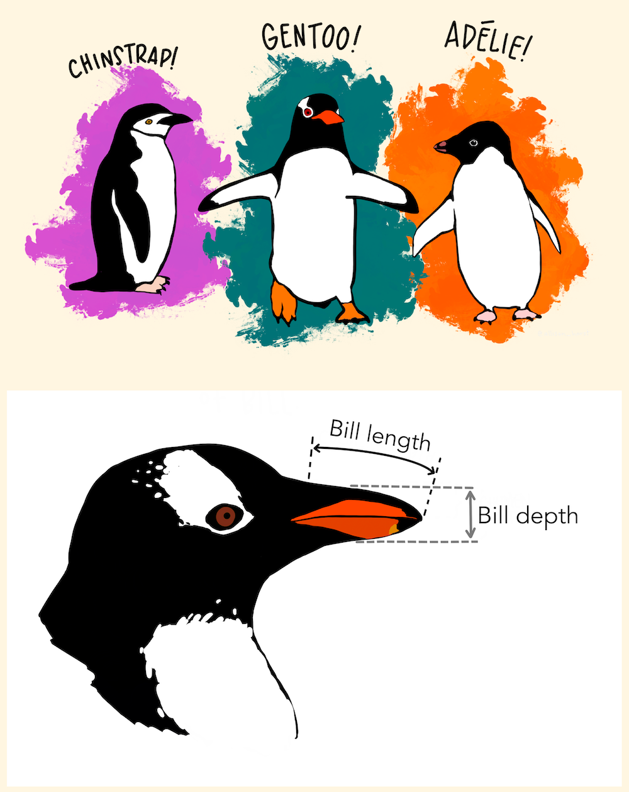
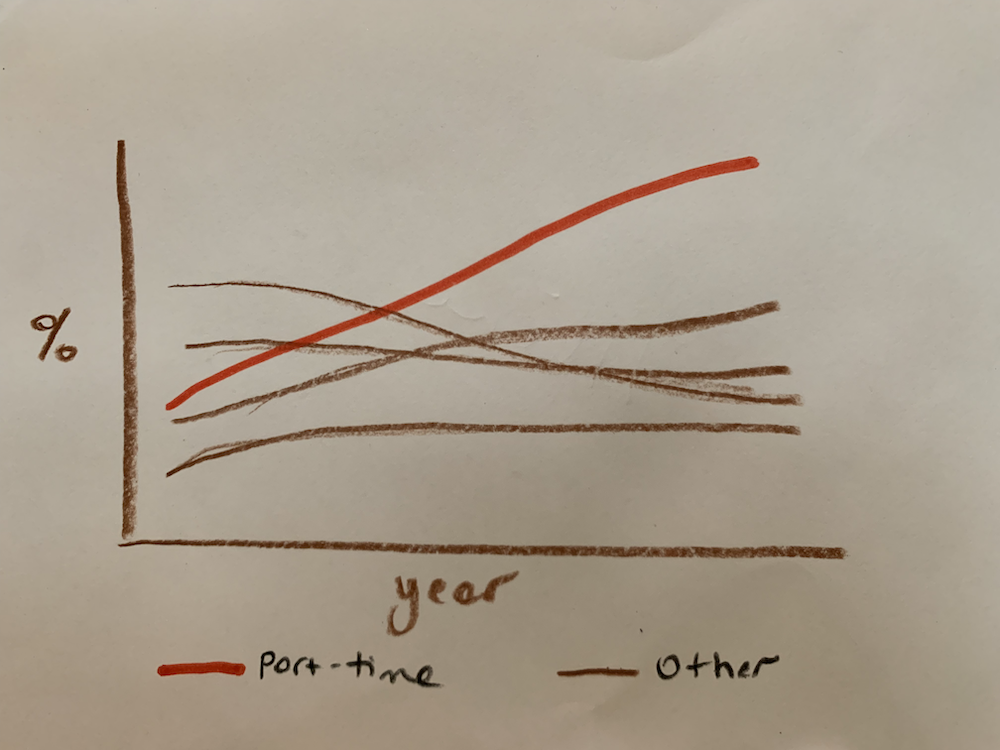
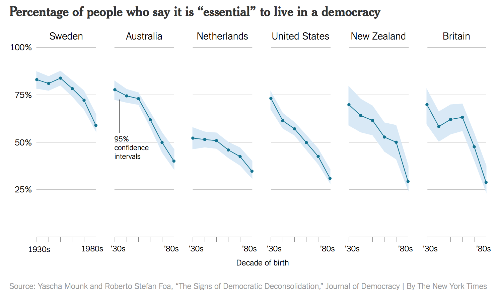
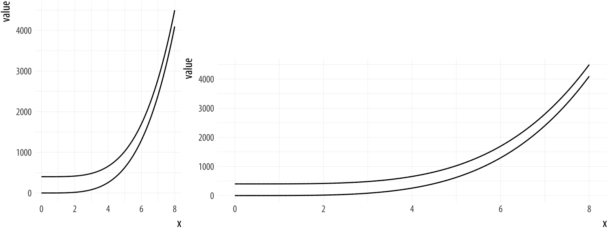

```{r setup, include=FALSE}
options(htmltools.dir.version = FALSE)
knitr::opts_chunk$set(
  fig.width = 8, fig.asp = 0.618, fig.retina = 3, dpi = 300,
  out.width = "60%",
  cache = FALSE,
  echo = TRUE,
  message = FALSE, 
  warning = FALSE,
  hiline = TRUE
)

xaringanExtra::use_panelset()
ggplot2::theme_set(ggplot2::theme_gray(base_size = 16))
library(countdown)
```

```{r xaringan-themer, include = FALSE, warning = FALSE}
library(xaringanthemer)
style_duo_accent(
  primary_color = "#468189",
  secondary_color = "#9DBEBB",
  inverse_header_color = "#F4E9CD",
  black_color = "#031926",
  code_highlight_color = "#F4E9CD",
  header_font_google = google_font("Atkinson Hyperlegible"),
  text_font_google   = google_font("Atkinson Hyperlegible", "300", "300i"),
  code_font_google   = google_font("Source Code Pro"),
  code_font_size = "20px",
  title_slide_background_color = "#9DBEBB",
  title_slide_text_color = "#F4E9CD",
  base_font_size = "24px",
  header_h1_font_size = "2rem",
  header_h2_font_size = "1.75rem",
  header_h3_font_size = "1.5rem",
  extra_css = list(
    "h1" = list("margin-block-start" = "0.4rem", 
                 "margin-block-end" = "0.4rem"),
    "h2" = list("margin-block-start" = "0.4rem", 
                 "margin-block-end" = "0.4rem"),
    "h3" = list("margin-block-start" = "0.4rem", 
                 "margin-block-end" = "0.4rem"),
    ".small" = list("font-size" = "90%"),
    ".midi" = list("font-size" = "85%"),
    ".large" = list("font-size" = "200%"),
    ".xlarge" = list("font-size" = "600%"),
    ".hand" = list("font-family" = "'Gochi Hand', cursive",
                   "font-size" = "125%"),
    ".task" = list("padding-right"    = "10px",
                   "padding-left"     = "10px",
                   "padding-top"      = "3px",
                   "padding-bottom"   = "3px",
                   "margin-bottom"    = "6px",
                   "margin-top"       = "6px",
                   "border-left"      = "solid 5px #F1DE67",
                   "background-color" = "#F1DE6750"),
    ".pull-left" = list("width" = "49%",
                        "float" = "left"),
    ".pull-right" = list("width" = "49%",
                         "float" = "right"),
    ".pull-left-wide" = list("width" = "70%",
                             "float" = "left"),
    ".pull-right-narrow" = list("width" = "27%",
                                "float" = "right"),
    ".pull-left-narrow" = list("width" = "27%",
                               "float" = "left"),
    ".pull-right-wide" = list("width" = "70%",
                              "float" = "right") 
    )
  )
```

class: middle, inverse

# 🔗 [bit.ly/dataviz-enar-2022](https://bit.ly/dataviz-enar-2022)

To follow along with the exercises, open and make a permanent copy of the RStudio Cloud project at https://rstudio.cloud/project/3796661.

---

class: middle, inverse

# Data visualization

---

## Data visualization

- Data visualization is the creation and study of the visual representation of data
- Many tools for visualizing data -- R is one of them
- Many approaches/systems within R for making data visualizations -- **ggplot2** is one of them, and that's what we're going to use

---

## ggplot2 $\in$ tidyverse

.pull-left[
```{r echo=FALSE, out.width="80%"}
knitr::include_graphics("images/ggplot2-part-of-tidyverse.png")
```
] 
.pull-right[ 
- **ggplot2** is tidyverse's data visualization package 
- `gg` in "ggplot2" stands for Grammar of Graphics 
- Inspired by the book **Grammar of Graphics** by Leland Wilkinson
]

---

## Grammar of Graphics

.pull-left-narrow[
A grammar of graphics is a tool that enables us to concisely describe the components of a graphic
]
.pull-right-wide[
```{r echo=FALSE, out.width="90%"}
knitr::include_graphics("images/grammar-of-graphics.png")
```
]

.footnote[
Source: [BloggoType](http://bloggotype.blogspot.com/2016/08/holiday-notes2-grammar-of-graphics.html)
]

---

## Hello ggplot2!

.pull-left-wide[
- `ggplot()` is the main function in ggplot2
- Plots are constructed in layers
- Structure of the code for plots can be summarized as

```{r eval = FALSE}
ggplot(data = [dataset], 
       mapping = aes(x = [x-variable], y = [y-variable])) +
   geom_xxx() +
   other options
```

- The ggplot2 package comes with the tidyverse

```{r}
library(tidyverse)
```

- For help with ggplot2, see [ggplot2.tidyverse.org](http://ggplot2.tidyverse.org/)
]

---

class: middle, inverse

# ggplot2 `r emo::ji("heart")` `r emo::ji("penguin")`

---

## ggplot2 $\in$ tidyverse

.pull-left[
```{r echo=FALSE, out.width="80%"}
knitr::include_graphics("images/ggplot2-part-of-tidyverse.png")
```
] 
.pull-right[ 
- **ggplot2** is tidyverse's data visualization package 
- Structure of the code for plots can be summarized as

```{r eval = FALSE}
ggplot(data = [dataset], 
       mapping = aes(x = [x-variable], 
                     y = [y-variable])) +
   geom_xxx() +
   other options
```
]

---

## Data: Palmer Penguins

Measurements for penguin species, island in Palmer Archipelago, size (flipper length, body mass, bill dimensions), and sex.

.pull-left-narrow[
```{r echo=FALSE, out.width="80%"}

```
]
.pull-right-wide[
```{r}
library(palmerpenguins)
glimpse(penguins)
```
]

---

.panelset[
.panel[.panel-name[Plot]
```{r ref.label = "penguins", echo = FALSE, warning = FALSE, out.width = "70%", fig.width = 8}
```
]
.panel[.panel-name[Code]

```{r penguins, fig.show = "hide"}
ggplot(data = penguins, 
       mapping = aes(x = bill_depth_mm, y = bill_length_mm,
                     colour = species)) +
  geom_point() +
  labs(title = "Bill depth and length",
       subtitle = "Dimensions for Adelie, Chinstrap, and Gentoo Penguins",
       x = "Bill depth (mm)", y = "Bill length (mm)",
       colour = "Species")
```
]
]

---

class: middle, inverse

# Coding out loud

---

.midi[
> **Start with the `penguins` data frame**
]

.pull-left[
```{r penguins-0, fig.show = "hide", warning = FALSE}
ggplot(data = penguins) #<<
```
]
.pull-right[
```{r ref.label = "penguins-0", echo = FALSE, warning = FALSE, out.width = "100%", fig.width = 8}
```
]

---

.midi[
> Start with the `penguins` data frame,
> **map bill depth to the x-axis**
]

.pull-left[
```{r penguins-1, fig.show = "hide", warning = FALSE}
ggplot(data = penguins,
       mapping = aes(x = bill_depth_mm)) #<<
```
]
.pull-right[
```{r ref.label = "penguins-1", echo = FALSE, warning = FALSE, out.width = "100%", fig.width = 8}
```
]

---

.midi[
> Start with the `penguins` data frame,
> map bill depth to the x-axis
> **and map bill length to the y-axis.**
]

.pull-left[
```{r penguins-2, fig.show = "hide", warning = FALSE}
ggplot(data = penguins,
       mapping = aes(x = bill_depth_mm,
                     y = bill_length_mm)) #<<
```
]
.pull-right[
```{r ref.label = "penguins-2", echo = FALSE, warning = FALSE, out.width = "100%", fig.width = 8}
```
]

---

.midi[
> Start with the `penguins` data frame,
> map bill depth to the x-axis
> and map bill length to the y-axis. 
> **Represent each observation with a point**
]

.pull-left[
```{r penguins-3, fig.show = "hide", warning = FALSE}
ggplot(data = penguins,
       mapping = aes(x = bill_depth_mm,
                     y = bill_length_mm)) + 
  geom_point() #<<
```
]
.pull-right[
```{r ref.label = "penguins-3", echo = FALSE, warning = FALSE, out.width = "100%", fig.width = 8}
```
]

---

.midi[
> Start with the `penguins` data frame,
> map bill depth to the x-axis
> and map bill length to the y-axis. 
> Represent each observation with a point
> **and map species to the colour of each point.**
]

.pull-left[
```{r penguins-4, fig.show = "hide", warning = FALSE}
ggplot(data = penguins,
       mapping = aes(x = bill_depth_mm,
                     y = bill_length_mm,
                     colour = species)) + #<<
  geom_point()
```
]
.pull-right[
```{r ref.label = "penguins-4", echo = FALSE, warning = FALSE, out.width = "100%", fig.width = 8}
```
]

---

.midi[
> Start with the `penguins` data frame,
> map bill depth to the x-axis
> and map bill length to the y-axis. 
> Represent each observation with a point
> and map species to the colour of each point.
> **Title the plot "Bill depth and length"**
]

.pull-left[
```{r penguins-5, fig.show = "hide", warning = FALSE}
ggplot(data = penguins,
       mapping = aes(x = bill_depth_mm,
                     y = bill_length_mm,
                     colour = species)) +
  geom_point() +
  labs(title = "Bill depth and length") #<<
```
]
.pull-right[
```{r ref.label = "penguins-5", echo = FALSE, warning = FALSE, out.width = "100%", fig.width = 8}
```
]

---

.midi[
> Start with the `penguins` data frame,
> map bill depth to the x-axis
> and map bill length to the y-axis. 
> Represent each observation with a point
> and map species to the colour of each point.
> Title the plot "Bill depth and length", 
> **add the subtitle "Dimensions for Adelie, Chinstrap, and Gentoo Penguins"**
]

.pull-left[
```{r penguins-6, fig.show = "hide", warning = FALSE}
ggplot(data = penguins,
       mapping = aes(x = bill_depth_mm,
                     y = bill_length_mm,
                     colour = species)) +
  geom_point() +
  labs(title = "Bill depth and length",
       subtitle = "Dimensions for Adelie, Chinstrap, and Gentoo Penguins") #<<
```
]
.pull-right[
```{r ref.label = "penguins-6", echo = FALSE, warning = FALSE, out.width = "100%", fig.width = 8}
```
]

---

.midi[
> Start with the `penguins` data frame,
> map bill depth to the x-axis
> and map bill length to the y-axis. 
> Represent each observation with a point
> and map species to the colour of each point.
> Title the plot "Bill depth and length", 
> add the subtitle "Dimensions for Adelie, Chinstrap, and Gentoo Penguins", 
> **label the x and y axes as "Bill depth (mm)" and "Bill length (mm)", respectively**
]

.pull-left[
```{r penguins-7, fig.show = "hide", warning = FALSE}
ggplot(data = penguins,
       mapping = aes(x = bill_depth_mm,
                     y = bill_length_mm,
                     colour = species)) +
  geom_point() +
  labs(title = "Bill depth and length",
       subtitle = "Dimensions for Adelie, Chinstrap, and Gentoo Penguins",
       x = "Bill depth (mm)", y = "Bill length (mm)") #<<
```
]
.pull-right[
```{r ref.label = "penguins-7", echo = FALSE, warning = FALSE, out.width = "100%", fig.width = 8}
```
]

---

.midi[
> Start with the `penguins` data frame,
> map bill depth to the x-axis
> and map bill length to the y-axis. 
> Represent each observation with a point
> and map species to the colour of each point.
> Title the plot "Bill depth and length", 
> add the subtitle "Dimensions for Adelie, Chinstrap, and Gentoo Penguins", 
> label the x and y axes as "Bill depth (mm)" and "Bill length (mm)", respectively,
> **label the legend "Species"**
]

.pull-left[
```{r penguins-8, fig.show = "hide", warning = FALSE}
ggplot(data = penguins,
       mapping = aes(x = bill_depth_mm,
                     y = bill_length_mm,
                     colour = species)) +
  geom_point() +
  labs(title = "Bill depth and length",
       subtitle = "Dimensions for Adelie, Chinstrap, and Gentoo Penguins",
       x = "Bill depth (mm)", y = "Bill length (mm)",
       colour = "Species") #<<
```
]
.pull-right[
```{r ref.label = "penguins-8", echo = FALSE, warning = FALSE, out.width = "100%", fig.width = 8}
```
]

---

.midi[
> Start with the `penguins` data frame,
> map bill depth to the x-axis
> and map bill length to the y-axis. 
> Represent each observation with a point
> and map species to the colour of each point.
> Title the plot "Bill depth and length", 
> add the subtitle "Dimensions for Adelie, Chinstrap, and Gentoo Penguins", 
> label the x and y axes as "Bill depth (mm)" and "Bill length (mm)", respectively,
> label the legend "Species", 
> **and add a caption for the data source.**
]

.pull-left[
```{r penguins-9, fig.show = "hide", warning = FALSE}
ggplot(data = penguins,
       mapping = aes(x = bill_depth_mm,
                     y = bill_length_mm,
                     colour = species)) +
  geom_point() +
  labs(title = "Bill depth and length",
       subtitle = "Dimensions for Adelie, Chinstrap, and Gentoo Penguins",
       x = "Bill depth (mm)", y = "Bill length (mm)",
       colour = "Species",
       caption = "Source: Palmer Station LTER / palmerpenguins package") #<<
```
]
.pull-right[
```{r ref.label = "penguins-9", echo = FALSE, warning = FALSE, out.width = "100%", fig.width = 8}
```
]

---

.midi[
> Start with the `penguins` data frame,
> map bill depth to the x-axis
> and map bill length to the y-axis. 
> Represent each observation with a point
> and map species to the colour of each point.
> Title the plot "Bill depth and length", 
> add the subtitle "Dimensions for Adelie, Chinstrap, and Gentoo Penguins", 
> label the x and y axes as "Bill depth (mm)" and "Bill length (mm)", respectively,
> label the legend "Species", 
> and add a caption for the data source.
> **Finally, use a discrete colour scale that is designed to be perceived by viewers with common forms of colour blindness.**
]

.pull-left[
```{r penguins-10, fig.show = "hide", warning = FALSE}
ggplot(data = penguins,
       mapping = aes(x = bill_depth_mm,
                     y = bill_length_mm,
                     colour = species)) +
  geom_point() +
  labs(title = "Bill depth and length",
       subtitle = "Dimensions for Adelie, Chinstrap, and Gentoo Penguins",
       x = "Bill depth (mm)", y = "Bill length (mm)",
       colour = "Species",
       caption = "Source: Palmer Station LTER / palmerpenguins package") +
  scale_colour_viridis_d() #<<
```
]
.pull-right[
```{r ref.label = "penguins-10", echo = FALSE, warning = FALSE, out.width = "100%", fig.width = 8}
```
]

---

.panelset[
.panel[.panel-name[Plot]
```{r ref.label="penguins-10-nohighlight", echo = FALSE, warning = FALSE, out.width = "70%", fig.width = 8}
```
]
.panel[.panel-name[Code]

```{r penguins-10-nohighlight, fig.show = "hide"}
ggplot(data = penguins,
       mapping = aes(x = bill_depth_mm,
                     y = bill_length_mm,
                     colour = species)) +
  geom_point() +
  labs(title = "Bill depth and length",
       subtitle = "Dimensions for Adelie, Chinstrap, and Gentoo Penguins",
       x = "Bill depth (mm)", y = "Bill length (mm)",
       colour = "Species",
       caption = "Source: Palmer Station LTER / palmerpenguins package") +
  scale_colour_viridis_d()
```
]
.panel[.panel-name[Narrative]
.pull-left-wide[
.midi[
Start with the `penguins` data frame,
map bill depth to the x-axis
and map bill length to the y-axis. 

Represent each observation with a point
and map species to the colour of each point.

Title the plot "Bill depth and length", 
add the subtitle "Dimensions for Adelie, Chinstrap, and Gentoo Penguins", 
label the x and y axes as "Bill depth (mm)" and "Bill length (mm)", respectively,
label the legend "Species", 
and add a caption for the data source.

Finally, use a discrete colour scale that is designed to be perceived by viewers with common forms of colour blindness.
]
]
]
]

---

## Argument names

.tip[
You can omit the names of first two arguments when building plots with `ggplot()`.
]

.pull-left[
```{r named-args, eval = FALSE}
ggplot(data = penguins,
       mapping = aes(x = bill_depth_mm,
                     y = bill_length_mm,
                     colour = species)) +
  geom_point() +
  scale_colour_viridis_d()
```
]
.pull-right[
```{r not-named-args, eval = FALSE}
ggplot(penguins,
       aes(x = bill_depth_mm,
           y = bill_length_mm,
           colour = species)) +
  geom_point() +
  scale_colour_viridis_d()
```
]

---

class: middle, inverse

# Aesthetics

---

## Aesthetics options

Commonly used characteristics of plotting characters that can be **mapped to a specific variable** in the data are

- `colour`
- `shape`
- `size`
- `alpha` (transparency)

---

## Colour

.pull-left[
```{r colour, fig.show = "hide", warning = FALSE}
ggplot(penguins,
       aes(x = bill_depth_mm, 
           y = bill_length_mm,
           colour = species)) + #<<
  geom_point() +
  scale_colour_viridis_d()
```
]
.pull-right[
```{r ref.label = "colour", echo = FALSE, warning = FALSE, out.width = "100%"}
```
]

---

## Shape

Mapped to a different variable than `colour`

.pull-left[
```{r shape-island, fig.show = "hide", warning = FALSE}
ggplot(penguins,
       aes(x = bill_depth_mm, 
           y = bill_length_mm,
           colour = species,
           shape = island)) + #<<
  geom_point() +
  scale_colour_viridis_d()
```
]
.pull-right[
```{r ref.label = "shape-island", echo = FALSE, warning = FALSE, out.width = "100%"}
```
]

---

## Shape

Mapped to same variable as `colour`

.pull-left[
```{r shape-species, fig.show = "hide", warning = FALSE}
ggplot(penguins,
       aes(x = bill_depth_mm, 
           y = bill_length_mm,
           colour = species,
           shape = species)) + #<<
  geom_point() +
  scale_colour_viridis_d()
```
]
.pull-right[
```{r ref.label = "shape-species", echo = FALSE, warning = FALSE, out.width = "100%"}
```
]

---

## Size

.pull-left[
```{r size, fig.show = "hide", warning = FALSE}
ggplot(penguins,
       aes(x = bill_depth_mm, 
           y = bill_length_mm,
           colour = species,
           shape = species,
           size = body_mass_g)) + #<<
  geom_point() +
  scale_colour_viridis_d()
```
]
.pull-right[
```{r ref.label = "size", echo = FALSE, warning = FALSE, out.width = "100%"}
```
]

---

## Alpha

.pull-left[
```{r alpha, fig.show = "hide", warning = FALSE}
ggplot(penguins,
       aes(x = bill_depth_mm, 
           y = bill_length_mm,
           colour = species,
           shape = species,
           size = body_mass_g,
           alpha = flipper_length_mm)) + #<<
  geom_point() +
  scale_colour_viridis_d()
```
]
.pull-right[
```{r ref.label = "alpha", echo = FALSE, warning = FALSE, out.width = "100%"}
```
]

---

.pull-left[
**Mapping**

```{r warning = FALSE, out.width = "100%"}
ggplot(penguins,
       aes(x = bill_depth_mm,
           y = bill_length_mm,
           size = body_mass_g, #<<
           alpha = flipper_length_mm)) + #<<
  geom_point()
```
]
.pull-right[
**Setting**

```{r warning = FALSE, out.width = "100%"}
ggplot(penguins,
       aes(x = bill_depth_mm,
           y = bill_length_mm)) + 
  geom_point(size = 2, alpha = 0.5) #<<
```
]

---

## Mapping vs. setting

- **Mapping:** Determine the size, alpha, etc. of points based on the values of a variable in the data
  - goes into `aes()`

- **Setting:** Determine the size, alpha, etc. of points **not** based on the values of a variable in the data
  - goes into `geom_*()` (this was `geom_point()` in the previous example, but we'll learn about other geoms soon!)
  
---

class: middle, inverse

# Faceting

---

## Faceting

- Smaller plots that display different subsets of the data
- Useful for exploring conditional relationships and large data

---

.panelset[
.panel[.panel-name[Plot]
```{r ref.label = "facet", echo = FALSE, warning = FALSE, out.width = "70%"}
```
]
.panel[.panel-name[Code]

```{r facet, fig.show = "hide"}
ggplot(penguins, aes(x = bill_depth_mm, y = bill_length_mm)) + 
  geom_point() +
  facet_grid(species ~ island) #<<
```
]
]

---

## Various ways to facet

.question[
In the next few slides describe what each plot displays. Think about how the code relates to the output.

**Note:** The plots in the next few slides do not have proper titles, axis labels, etc. because we want you to figure out what's happening in the plots.
But you should always label your plots!
]

---

```{r warning = FALSE}
ggplot(penguins, aes(x = bill_depth_mm, y = bill_length_mm)) + 
  geom_point() +
  facet_grid(species ~ sex) #<<
```

---

```{r warning = FALSE}
ggplot(penguins, aes(x = bill_depth_mm, y = bill_length_mm)) + 
  geom_point() +
  facet_grid(sex ~ species) #<<
```

---

```{r warning = FALSE, fig.asp = 0.5}
ggplot(penguins, aes(x = bill_depth_mm, y = bill_length_mm)) + 
  geom_point() +
  facet_wrap(~ species) #<<
```

---

```{r warning = FALSE, fig.asp = 0.5}
ggplot(penguins, aes(x = bill_depth_mm, y = bill_length_mm)) + 
  geom_point() +
  facet_grid(. ~ species) #<<
```

---

```{r warning = FALSE}
ggplot(penguins, aes(x = bill_depth_mm, y = bill_length_mm)) + 
  geom_point() +
  facet_wrap(~ species, ncol = 2) #<<
```

---

## Faceting summary

- `facet_grid()`:
    - 2d grid
    - `rows ~ cols`
    - use `.` for no split
- `facet_wrap()`: 1d ribbon wrapped according to number of rows and columns specified or available plotting area

---

## Facet and color

.panelset[
.panel[.panel-name[Plot]
```{r ref.label = "facet-color-legend", echo = FALSE, warning = FALSE}
```
]
.panel[.panel-name[Code]

```{r facet-color-legend, fig.show = "hide"}
ggplot(
  penguins, 
  aes(x = bill_depth_mm, 
      y = bill_length_mm, 
      color = species)) + #<<
  geom_point() +
  facet_grid(species ~ sex) +
  scale_color_viridis_d() #<<
```
]
]

---

## Facet and color, no legend

.panelset[
.panel[.panel-name[Plot]
```{r ref.label = "facet-color-no-legend", echo = FALSE, warning = FALSE}
```
]
.panel[.panel-name[Code]

```{r facet-color-no-legend, fig.show = "hide"}
ggplot(
  penguins, 
  aes(x = bill_depth_mm, 
      y = bill_length_mm, 
      color = species)) +
  geom_point(show.legend = FALSE) + #<<
  facet_grid(species ~ sex) +
  scale_color_viridis_d() 
```
]
]

---

class: middle, inverse

# Take a sad plot, and make it better

---

The American Association of 
University Professors (AAUP) is a nonprofit membership association of faculty 
and other academic professionals. 
[This report](https://www.aaup.org/sites/default/files/files/AAUP_Report_InstrStaff-75-11_apr2013.pdf) 
by the AAUP shows trends in instructional staff employees between 1975 
and 2011, and contains an image very similar to the one given below.

```{r echo=FALSE,out.width="80%",fig.align="center"}
knitr::include_graphics("images/staff-employment.png")
```

---

Each row in this dataset represents a faculty type, and the columns are the years for which we have data. 
The values are percentage of hires of that type of faculty for each year.

```{r load-data-staff, message=FALSE}
staff <- read_csv("data/instructional-staff.csv")
staff
```

---

## Recreate the visualization

In order to recreate this visualization we need to first reshape the data to have one variable for faculty type and one variable for year. In other words, we will convert the data from the long format to wide format. 

But before we do so... 

.task[
If the long data will have a row for each year/faculty type combination, and there are 5 faculty types and 11 years of data, how many rows will the data have?
]

---

class: center, middle

```{r echo = FALSE, out.width = "80%", fig.align = "center"}
knitr::include_graphics("images/pivot.gif")
```

---

## `pivot_*()` functions


```{r echo=FALSE}
knitr::include_graphics("images/tidyr-longer-wider.gif")
```

---

## `pivot_longer()`

```{r eval=FALSE}
pivot_longer(data, cols, names_to = "name", values_to = "value")
```

- The first argument is `data` as usual.
- The second argument, `cols`, is where you specify which columns to pivot 
into longer format -- in this case all columns except for the `faculty_type` 
- The third argument, `names_to`, is a string specifying the name of the column to create from the data stored in the column names of data -- in this case `year`
- The fourth argument, `values_to`, is a string specifying the name of the column to create from the data stored in cell values, in this case `percentage`

---

## Pivot instructor data

.midi[
```{r}
library(tidyverse)

staff_long <- staff %>%
  pivot_longer(cols = -faculty_type, names_to = "year", 
               values_to = "percentage") %>%
  mutate(percentage = as.numeric(percentage))

staff_long
```
]

---

.question[
This doesn't look quite right, how would you fix it?
]

.small[
```{r fig.height=2}
staff_long %>%
  ggplot(aes(x = percentage, y = year, color = faculty_type)) +
  geom_col(position = "dodge")
```
]

---

.midi[
```{r fig.height=2}
staff_long %>%
  ggplot(aes(x = percentage, y = year, fill = faculty_type)) +
  geom_col(position = "dodge")
```
]

---

## Some improvement...

.midi[
```{r fig.height=2}
staff_long %>%
  ggplot(aes(x = percentage, y = year, fill = faculty_type)) +
  geom_col()
```
]

---

## More improvement

.midi[
```{r out.width = "100%", fig.asp = 0.4, fig.width = 7}
staff_long %>%
  ggplot(aes(x = year, y = percentage, group = faculty_type, 
             color = faculty_type)) +
  geom_line() +
  theme_minimal()
```
]

---

## Goal: even more improvement!

.task[
I want to achieve the following look but I have no idea how!
]

```{r instructor-lines-for-show, echo = FALSE, out.width = "70%"}

```

---

.panelset[
.panel[.panel-name[Plot]

```{r instructor-lines, echo = FALSE, fig.width = 7, out.width = "100%", fig.asp = 0.5}
library(scales)

staff_long %>%
  mutate( #<<
    part_time = if_else(faculty_type == "Part-Time Faculty", #<<
                        "Part-Time Faculty", "Other Faculty"), #<<
    year = as.numeric(year) #<<
    ) %>% #<<
  ggplot(aes(x = year, y = percentage/100, group = faculty_type, 
             color = part_time)) +
  geom_line() +
  scale_color_manual(values = c("gray", "red")) + #<<
  scale_y_continuous(labels = label_percent(accuracy = 1)) + #<<
  theme_minimal() +
  labs(
    title = "Instructional staff employment trends",
    x = "Year", y = "Percentage", color = NULL
  ) +
  theme(legend.position = "bottom") #<<
```

]

.panel[.panel-name[Code]

```{r ref.label = "instructor-lines", fig.show = "hide"}
```

]
]

---

class: middle, inverse

# A/B testing

---

## Data: Sale prices of houses in Duke Forest

.pull-left[
- Data on houses that were sold in the Duke Forest neighborhood of Durham, NC around November 2020

- Scraped from Zillow

- Source: `openintro::duke_forest`
]
.pull-right[
```{r echo=FALSE, out.width = "100%", fig.align = "right", fig.alt = "Home in Duke Forest"}
knitr::include_graphics("images/duke_forest_home.jpg")
```
]

---

## `openintro::duke_forest`

```{r}
library(openintro)

glimpse(duke_forest)
```

---

## A simple visualization

.panelset[
```{r panelset = c(output = "Plot", source = "Code"), out.width = "70%"}
ggplot(duke_forest, aes(x = area, y = price)) +
  geom_point(alpha = 0.7, size = 2) +
  geom_smooth(method = "lm", se = FALSE, size = 0.7) +
  labs(
    x = "Area (square feet)",
    y = "Sale price (USD)",
    title = "Price and area of houses in Duke Forest"
  )
```
]

---

## New variable: `decade_built`

```{r}
duke_forest <- duke_forest %>%
  mutate(decade_built = (year_built %/% 10) * 10)

duke_forest %>%
  select(year_built, decade_built)
```

---

## Distribution of `decade_built`

```{r}
duke_forest <- duke_forest %>%
  mutate(
    decade_built = (year_built %/% 10) * 10
  )

duke_forest %>%
  count(decade_built)
```

---

## New variable: `decade_built_cat`

```{r}
duke_forest <- duke_forest %>%
  mutate(
    decade_built_cat = case_when(
      decade_built <= 1940 ~ "1940 or before",
      decade_built >= 1990 ~ "1990 or after",
      TRUE                 ~ as.character(decade_built)
    )
  )

duke_forest %>%
  count(decade_built_cat)
```

---

## A slightly more complex visualization

.panelset[
```{r panelset = c(output = "Plot", source = "Code"), out.width = "90%", fig.asp = 0.5, fig.width = 10}
ggplot(duke_forest, aes(x = area, y = price, color = decade_built_cat)) +
  geom_point(alpha = 0.7, show.legend = FALSE) +
  geom_smooth(method = "lm", se = FALSE, size = 0.5, show.legend = FALSE) +
  facet_wrap(~decade_built_cat) +
  labs(
    x = "Area (square feet)",
    y = "Sale price (USD)",
    color = "Decade built",
    title = "Price and area of houses in Duke Forest"
  )
```
]

---

class: middle

.task[
In the next two slides, the same plots are created with different "cosmetic" choices. Examine the plots two given (Plot A and Plot B), and indicate your preference by voting for one of them in the Vote tab.
]

---

## Test 1

.panelset[
.panel[.panel-name[Plot A]
```{r test-1-a, echo = FALSE, out.width = "90%", fig.asp = 0.5, fig.width = 10}
ggplot(duke_forest, aes(x = area, y = price, color = decade_built_cat)) +
  geom_point(alpha = 0.7, show.legend = FALSE) +
  geom_smooth(method = "lm", se = FALSE, size = 0.5, show.legend = FALSE) +
  facet_wrap(~decade_built_cat) +
  labs(
    x = "Area (square feet)",
    y = "Sale price (USD)",
    color = "Decade built",
    title = "Price and area of houses in Duke Forest",
  ) +
  theme_dark(base_size = 16) + #<<
  scale_color_manual(values = c("yellow", "blue", "orange", "red", "green", "white")) + #<<
  theme( #<<
    text = element_text(color = "red", face = "bold.italic"), #<<
    plot.background = element_rect(fill = "yellow") #<<
  ) #<<
```
]
.panel[.panel-name[Plot B]
```{r test-1-b, echo = FALSE, out.width = "90%", fig.asp = 0.5, fig.width = 10}
ggplot(duke_forest, aes(x = area, y = price, color = decade_built_cat)) +
  geom_point(alpha = 0.7, show.legend = FALSE) +
  geom_smooth(method = "lm", se = FALSE, size = 0.5, show.legend = FALSE) +
  facet_wrap(~decade_built_cat) +
  labs(
    x = "Area (square feet)",
    y = "Sale price (USD)",
    color = "Decade built",
    title = "Price and area of houses in Duke Forest"
  ) +
  theme_minimal(base_size = 16) +  #<<
  scale_color_viridis_d(end = 0.9)  #<<
```
]
]

---

## Test 2

.panelset[
.panel[.panel-name[Plot A]
```{r ref.label = "test-1-b", echo = FALSE, out.width = "90%", fig.asp = 0.5, fig.width = 10}
```
]
.panel[.panel-name[Plot B]
```{r test-2-b, echo = FALSE, out.width = "90%", fig.asp = 0.5, fig.width = 10}
ggplot(duke_forest, aes(x = area, y = price, color = decade_built_cat)) +
  geom_point(alpha = 0.5, size = 2, show.legend = FALSE) +
  geom_smooth(method = "lm", se = FALSE, size = 0.5, show.legend = FALSE) +
  facet_wrap(~decade_built_cat) +
  labs(
    x = "Area (square feet)",
    y = "Sale price (USD)",
    color = "Decade built",
    title = "Price and area of houses in Duke Forest"
  ) +
  scale_color_viridis_d(end = 0.8, option = "A") #<<
```
]
]

---

class: middle

.large[
.hand[
a deeper look at the plotting code...
]
]

---

## Minimal theme + viridis scale, default option

.panelset[
.panel[.panel-name[Plot]
```{r ref.label = "test-1-b", out.width = "90%", fig.asp = 0.5, fig.width = 10, echo = FALSE}
```
]
.panel[.panel-name[Code]
```{r ref.label = "test-1-b", fig.show = 'hide'}
```
]
]

---

## Viridis scale, option A (magma)

.panelset[
.panel[.panel-name[Plot]
```{r ref.label = "test-2-b", out.width = "90%", fig.asp = 0.5, fig.width = 10, echo = FALSE}
```
]
.panel[.panel-name[Code]
```{r ref.label = "test-2-b", fig.show = 'hide'}
```
]
]

---

## Dark theme + further theme customization

.panelset[
.panel[.panel-name[Plot]
```{r ref.label = "test-1-a", out.width = "90%", fig.asp = 0.5, fig.width = 10, echo = FALSE}
```
]
.panel[.panel-name[Code]
```{r ref.label = "test-1-a", fig.show = 'hide'}
```
]
]

---

class: middle, inverse

# What makes bad figures bad?

---

## Bad taste

```{r ref.label = "test-1-a", echo = FALSE, out.width = "90%", fig.asp = 0.5, fig.width = 10}
```

---

## Data-to-ink ratio

.pull-left-wide[
Tufte strongly recommends maximizing the **data-to-ink ratio** this in the Visual Display of Quantitative Information (Tufte, 1983).

> Graphical excellence is the well-designed presentation of interesting data—a matter of substance, of statistics, and of design … [It] consists of complex ideas communicated with clarity, precision, and efficiency. … [It] is that which gives to the viewer the greatest number of ideas in the shortest time with the least ink in the smallest space … [It] is nearly always multivariate … And graphical excellence requires telling the truth about the data. (Tufte, 1983, p. 51).

]
.pull-right-narrow[
```{r echo=FALSE, out.width = "100%", fig.align = "right", fig.alt = "Cover of Visual Display of Quantitative Information, Tufte (1983)."}
knitr::include_graphics("images/tufte-visual-display-cover.png")
```
]

---

.task[
Which of the plots has higher data-to-ink ratio?
]

```{r mean-area-decade-summary, echo = FALSE, results = "hide"}
mean_area_decade <- duke_forest %>%
  group_by(decade_built_cat) %>%
  summarise(mean_area = mean(area))

mean_area_decade
```

.panelset[
.panel[.panel-name[Plot A]
```{r mean-area-decade-a, out.width = "70%", echo = FALSE}
ggplot(mean_area_decade, aes(y = decade_built_cat, x = mean_area)) +
  geom_col() + #<<
  labs(
    x = "Mean area (square feet)", y = "Decade built",
    title = "Mean area of houses in Duke Forest, by decade built"
  ) +
  theme_minimal(base_size = 16)
```
]
.panel[.panel-name[Plot B]
```{r mean-area-decade-b, out.width = "70%", echo = FALSE}
ggplot(mean_area_decade, aes(y = decade_built_cat, x = mean_area)) +
  geom_point(size = 4) + #<<
  labs(
    x = "Mean area (square feet)", y = "Decade built",
    title = "Mean area of houses in Duke Forest, by decade built"
  ) +
  theme_minimal(base_size = 16)
```
]
]

---

class: middle

.large[
.hand[
a deeper look at the plotting code...
]
]

---

## Summary statistics

```{r ref.label = "mean-area-decade-summary"}
```

---

## Barplot

.panelset[
.panel[.panel-name[Plot]
```{r ref.label = "mean-area-decade-a", out.width = "70%", echo = FALSE}
```
]
.panel[.panel-name[Code]
```{r ref.label = "mean-area-decade-a", out.width = "70%", fig.show = "hide"}
```
]
]


---

## Scatterplot

.panelset[
.panel[.panel-name[Plot]
```{r ref.label = "mean-area-decade-b", out.width = "70%", echo = FALSE}
```
]
.panel[.panel-name[Code]
```{r ref.label = "mean-area-decade-b", fig.show = "hide"}
```
]
]

---

## Lollipop plot -- a happy medium?

.panelset[
.panel[.panel-name[Plot]
```{r mean-area-decade-lollipop, out.width = "70%", echo = FALSE}
ggplot(mean_area_decade, aes(y = decade_built_cat, x = mean_area)) +
  geom_point(size = 4) +
  geom_segment( #<<
    aes( #<<
      x = 0, xend = mean_area, #<<
      y = decade_built_cat, yend = decade_built_cat #<<
    ) #<<
  ) + #<<
  labs(
    x = "Mean area (square feet)", y = "Decade built",
    title = "Mean area of houses in Duke Forest, by decade built"
  ) +
  theme_minimal(base_size = 16)
```
]
.panel[.panel-name[Code]
```{r ref.label = "mean-area-decade-lollipop", fig.show = "hide"}
```
]
]

---

## Bad data

.panelset[
.panel[.panel-name[Original]
```{r echo = FALSE, fig.alt = "A crisis of faith in democracy? New York Times.", out.width = "50%"}

```
]
.panel[.panel-name[Improved]
```{r echo = FALSE, fig.alt = "A crisis of faith in democracy? New York Times.", out.width = "50%"}
knitr::include_graphics("images/healy-democracy-voeten-version-2.png")
```
]
]

.footnote[
Healy, Data Visualization: A practical introduction. [Chapter 1](https://socviz.co/lookatdata.html). Figures 1.8 and 1.9.
]

---

## Bad perception

```{r echo = FALSE, fig.alt = "Aspect ratios affect our perception of rates of change, modeled after an example by William S. Cleveland.", out.width = "80%"}

```

.footnote[
Healy, Data Visualization: A practical introduction. [Chapter 1](https://socviz.co/lookatdata.html). Figure 1.12.
]

---

class: middle, inverse

# Aesthetic mappings in ggplot2

---

## A second look: lollipop plot

.panelset[
.panel[.panel-name[Plot]
```{r mean-area-decade-lollipop-layer, out.width = "70%", echo = FALSE}
ggplot(mean_area_decade, aes(y = decade_built_cat, x = mean_area)) +
  geom_point(size = 4) +
  geom_segment(aes(
    x = 0, xend = mean_area,
    y = decade_built_cat, yend = decade_built_cat
  )) +
  labs(
    x = "Mean area (square feet)", y = "Decade built",
    title = "Mean area of houses in Duke Forest, by decade built"
  ) +
  theme_minimal(base_size = 16)
```
]
.panel[.panel-name[Code]
```{r ref.label = "mean-area-decade-lollipop-layer", fig.show = "hide"}
```
]
]

---

## Activity: Spot the difference I

.task[
Can you spot the differences between the code here and the one provided in the previous slide? Are there any differences in the resulting plot? Work in a pair (or group) to answer.
]

.panelset[
.panel[.panel-name[Plot]
```{r mean-area-decade-lollipop-global, out.width = "50%", echo = FALSE}
ggplot(mean_area_decade, aes(y = decade_built_cat, x = mean_area)) +
  geom_point(size = 4) +
  geom_segment(aes(
    xend = 0,
    yend = decade_built_cat
  )) +
  labs(
    x = "Mean area (square feet)", y = "Decade built",
    title = "Mean area of houses in Duke Forest, by decade built"
  ) +
  theme_minimal(base_size = 16)
```
]
.panel[.panel-name[Code]
```{r ref.label = "mean-area-decade-lollipop-global", fig.show = "hide"}
```
]
]

```{r echo = FALSE}
countdown(minutes = 3, bottom = 0)
```

---

## Global vs. layer-specific aesthetics

- Aesthetic mappings can be supplied in the initial `ggplot()` call, in individual layers, or in some combination of both.

- Within each layer, you can add, override, or remove mappings.

- If you only have one layer in the plot, the way you specify aesthetics doesn’t make any difference. However, the distinction is important when you start adding additional layers.

---

## Wrap up

.task[
Think back to all the plots you saw in the lecture, without flipping back through the slides. Which plot first comes to mind? Describe it in words.
]

---

.task[
Change the theme of the following plot to something else. 
See https://ggplot2.tidyverse.org/reference/theme.html for options.
Make other improvements as you see fit.
]

```{r echo = FALSE}
ggplot(duke_forest, aes(x = area, y = price, color = decade_built_cat)) +
  geom_point(alpha = 0.7, show.legend = FALSE) +
  geom_smooth(method = "lm", se = FALSE, size = 0.5, show.legend = FALSE) +
  facet_wrap(~decade_built_cat) +
  labs(
    x = "Area (square feet)",
    y = "Sale price (USD)",
    color = "Decade built",
    title = "Price and area of houses in Duke Forest",
  )
```