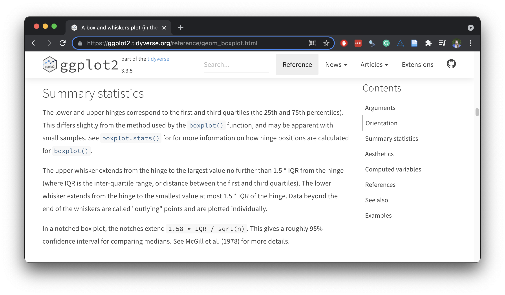

```{r setup, include=FALSE}
options(htmltools.dir.version = FALSE)
knitr::opts_chunk$set(
  fig.width = 8, fig.asp = 0.618, fig.retina = 3, dpi = 300,
  out.width = "60%",
  cache = FALSE,
  echo = TRUE,
  message = FALSE, 
  warning = FALSE,
  hiline = TRUE
)

xaringanExtra::use_panelset()
ggplot2::theme_set(ggplot2::theme_gray(base_size = 16))
library(countdown)
```

```{r xaringan-themer, include = FALSE, warning = FALSE}
library(xaringanthemer)
style_duo_accent(
  primary_color = "#468189",
  secondary_color = "#9DBEBB",
  inverse_header_color = "#F4E9CD",
  black_color = "#031926",
  code_highlight_color = "#F4E9CD",
  header_font_google = google_font("Atkinson Hyperlegible"),
  text_font_google   = google_font("Atkinson Hyperlegible", "300", "300i"),
  code_font_google   = google_font("Source Code Pro"),
  code_font_size = "20px",
  title_slide_background_color = "#9DBEBB",
  title_slide_text_color = "#F4E9CD",
  base_font_size = "24px",
  header_h1_font_size = "2rem",
  header_h2_font_size = "1.75rem",
  header_h3_font_size = "1.5rem",
  extra_css = list(
    "h1" = list("margin-block-start" = "0.4rem", 
                 "margin-block-end" = "0.4rem"),
    "h2" = list("margin-block-start" = "0.4rem", 
                 "margin-block-end" = "0.4rem"),
    "h3" = list("margin-block-start" = "0.4rem", 
                 "margin-block-end" = "0.4rem"),
    ".small" = list("font-size" = "90%"),
    ".midi" = list("font-size" = "85%"),
    ".large" = list("font-size" = "200%"),
    ".xlarge" = list("font-size" = "600%"),
    ".hand" = list("font-family" = "'Gochi Hand', cursive",
                   "font-size" = "125%"),
    ".task" = list("padding-right"    = "10px",
                   "padding-left"     = "10px",
                   "padding-top"      = "3px",
                   "padding-bottom"   = "3px",
                   "margin-bottom"    = "6px",
                   "margin-top"       = "6px",
                   "border-left"      = "solid 5px #F1DE67",
                   "background-color" = "#F1DE6750"),
    ".pull-left" = list("width" = "49%",
                        "float" = "left"),
    ".pull-right" = list("width" = "49%",
                         "float" = "right"),
    ".pull-left-wide" = list("width" = "70%",
                             "float" = "left"),
    ".pull-right-narrow" = list("width" = "27%",
                                "float" = "right"),
    ".pull-left-narrow" = list("width" = "27%",
                               "float" = "left"),
    ".pull-right-wide" = list("width" = "70%",
                              "float" = "right") 
    )
  )
```

class: middle, inverse

# 🔗 [bit.ly/dataviz-enar-2022](https://bit.ly/dataviz-enar-2022)

To follow along with the exercises, open and make a permanent copy of the RStudio Cloud project at https://rstudio.cloud/project/3796661.

---

class: middle, inverse

# Workflow notes

---

## IDE

- Plots panel:
  - Avoiding the `Error in plot.new() : figure margins too large` error
  - Zooming in
- Panel layout
- Themes

---

## Code style: ggplot2

- Line breaks after `+`
- Spaces around ` = `
- Otherwise spacing around punctuation as you would in English
  - Space after `, `
  - No space around `(` and `)`
- Indent all lines after `ggplot()`

```{r eval = FALSE}
# bad
ggplot(mtcars, aes(x=mpg,y =disp))+
geom_point()

# bad
ggplot(mtcars, aes(x=mpg,y =disp))+geom_point()

# good
ggplot(mtcars, aes(x = mpg, y = disp)) +
  geom_point()
```

---

## Code style: comments

- Place comment above the relevant code
- Short comments can be placed in the same line as well

```{r eval = FALSE}
# good
ggplot(mtcars, aes(x = mpg, y = disp)) +
  geom_point() # points (short comment)

# good
# scatterplot of mpg vs. disp (long comment)
ggplot(mtcars, aes(x = mpg, y = disp)) +
  geom_point()

# bad
ggplot(mtcars, aes(x = mpg, y = disp)) +
  geom_point()
  # above code plots mpg vs. disp
```

---

class: inverse, middle

# Setup

---

## Packages + figures

```{r}
# load packages
library(tidyverse)
library(openintro)

# set default theme for ggplot2
ggplot2::theme_set(ggplot2::theme_minimal(base_size = 16))

# set default figure parameters for knitr
knitr::opts_chunk$set(
  fig.width = 8,
  fig.asp = 0.618,
  fig.retina = 3,
  dpi = 300,
  out.width = "60%"
)
```

---

## Data prep

```{r}
duke_forest <- openintro::duke_forest %>%
  mutate(
    decade_built = (year_built %/% 10) * 10,
    decade_built_cat = case_when(
      decade_built <= 1940 ~ "1940 or before",
      decade_built >= 1990 ~ "1990 or after",
      TRUE                 ~ as.character(decade_built)
    ),
    decade_built_cat = factor(decade_built_cat, ordered = TRUE)
  )
```

---

## New data prep: `parking`

.small[
```{r}
duke_forest %>%
  distinct(parking) %>%
  print(n = 20)
```
]

---

## Recode `parking`

```{r}
duke_forest <- duke_forest %>%
  mutate(
    parking = case_when(
      parking == "0 spaces" ~ "Street",
      str_detect(parking, "Carport") ~ "Carport",
      str_detect(parking, "Garage") ~ "Garage",
      str_detect(parking, "Covered") ~ "Covered",
      TRUE ~ parking
    )
  )

duke_forest %>% 
  count(parking)
```

---

class: middle, inverse

.large[.hand[wrap up...]]

# geoms

---

## Three variables

- `geom_contour()`: contours
- `geom_tile()`: tile the plane with rectangles
- `geom_raster()`: fast version of `geom_tile()` for equal sized tiles

---

## `geom_tile()`

```{r}
ggplot(duke_forest, aes(x = bed, y = bath)) +
 geom_tile(aes(fill = price))
```

---

## Another look at smooth-ish surface

.panelset[
.panel[.panel-name[Summarize]
.small[
```{r}
mean_price_bed_bath <- duke_forest %>%
  group_by(bed, bath) %>%
  summarize(mean_price = mean(price), .groups = "drop")

mean_price_bed_bath
```
]
]
.panel[.panel-name[Plot]
```{r}
ggplot(mean_price_bed_bath, aes(x = bed, y = bath)) +
  geom_point(aes(color = mean_price), size = 10, pch = "square")
```
]
]

---

## Activity: Pick a geom

.task[
For each of the following problems, suggest a useful geom:

1. Display how the value of variable has changed over time
1. Show the detailed distribution of a single continuous variable
1. Focus attention on the overall relationship between two variables in a large dataset
1. Label outlying points in a single variable
]

```{r echo = FALSE}
countdown(minutes = 3, bottom = 0)
```

---

class: middle, inverse

# Stats

---

## Stats < > geoms

- Statistical transformation (**stat**) transforms the data, typically by summarizing
- Many of ggplot2’s stats are used behind the scenes to generate many important geoms

|`stat`            | geom              |
|------------------|-------------------|
|`stat_bin()`      | `geom_bar()`, `geom_freqpoly()`, `geom_histogram()` |
|`stat_bin2d()`    | `geom_bin2d()`    |
|`stat_bindot()`   | `geom_dotplot()`  |
|`stat_binhex()`   | `geom_hex()`      |
|`stat_boxplot()`  | `geom_boxplot()`  |
|`stat_contour()`  | `geom_contour()`  |
|`stat_quantile()` | `geom_quantile()` |
|`stat_smooth()`   | `geom_smooth()`   |
|`stat_sum()`      | `geom_count()`    |

---

## `stat_boxplot()`

```{r echo = FALSE, fig.alt = "Documentation for `stat_boxplot()`.", out.width = "90%"}

```

---

## Layering with stats

```{r}
ggplot(duke_forest, aes(x = parking, y = price)) + 
  geom_point(alpha = 0.5) + 
  stat_summary(geom = "point", fun = "median", colour = "red", size = 5, pch = 4, stroke = 2) #<<
```

---

## Alternate: layering with stats

```{r}
ggplot(duke_forest, aes(x = parking, y = price)) + 
  geom_point(alpha = 0.5) + 
  geom_point(stat = "summary", fun = "median", colour = "red", size = 5, pch = 4, stroke = 2) #<<
```

---

## Statistical transformations

.task[
What can you say about the distribution of price from the following QQ plot?
]

.small[
```{r out.width = "50%"}
ggplot(duke_forest, aes(sample = price)) +
  stat_qq() + #<<
  stat_qq_line() + #<<
  labs(y = "price")
```
]

---

class: middle, inverse

# Scales

---

## What is a scale?

- Each scale is a function from a region in data space (the domain of the scale) to a region in aesthetic space (the range of the scale)

- The axis or legend is the inverse function: it allows you to convert visual properties back to data

---

## Scale specification

Every aesthetic in your plot is associated with exactly one scale:

.panelset[
.panel[.panel-name[Code]
```{r fig.show = "hide"}
# automatic scales
ggplot(duke_forest, aes(x = area, y = price, color = parking)) + 
  geom_point(alpha = 0.8)

# manual scales
ggplot(duke_forest, aes(x = area, y = price, color = parking)) + 
  geom_point(alpha = 0.8) +
  scale_x_continuous() + 
  scale_y_continuous() + 
  scale_colour_ordinal()
```
]
.panel[.panel-name[Plot]
```{r echo = FALSE}
ggplot(duke_forest, aes(x = area, y = price, color = parking)) + 
  geom_point(alpha = 0.8)
```
]
]

---

## Anatomy of a scale function

.large[
.center[
`scale_A_B()`
]
]

- Always starts with `scale`
- `A`: Name of the primary aesthetic (e.g., `colour`, `shape`, `x`)
- `B`: Name of the scale (e.g., `continuous`, `discrete`, `brewer`)

---

## Guess the output

.task[
What will the x-axis label of the following plot say?
]

```{r fig.show = "hide", message = FALSE}
ggplot(duke_forest, aes(x = area, y = price, color = parking)) + 
  geom_point(alpha = 0.8) +
  scale_x_continuous(name = "Area") +
  scale_x_continuous(name = "Area (sq ft)") 
```

```{r echo = FALSE}
countdown(minutes = 2, bottom = 0)
```

---

## "Address" messages

```{r out.width = "50%"}
ggplot(duke_forest, aes(x = area, y = price, color = parking)) + 
  geom_point(alpha = 0.8) +
  scale_x_continuous(name = "Area") +
  scale_x_continuous(name = "Area (sq ft)") 
```

---

## Guess the output

.task[
What happens if you pair a discrete variable with a continuous scale? What happens if you pair a continuous variable with a discrete scale? Answer in the context of the following plots.
]

```{r eval = FALSE}
ggplot(duke_forest, aes(x = parking, y = price)) + 
  geom_point(alpha = 0.5) +
  scale_x_continuous()

ggplot(duke_forest, aes(x = parking, y = price)) + 
  geom_point(alpha = 0.5) +
  scale_y_discrete()
```

```{r echo = FALSE}
countdown(minutes = 3, bottom = 0)
```

---

## Transformations

When working with continuous data, the default is to map linearly from the data space onto the aesthetic space, but this scale can be transformed

.panelset[
.panel[.panel-name[Linear]
```{r out.width = "45%"}
ggplot(duke_forest, aes(x = area, y = price)) + 
  geom_point(alpha = 0.5)
```
]
.panel[.panel-name[Transformed]
```{r out.width = "45%"}
ggplot(duke_forest, aes(x = area, y = price)) + 
  geom_point(alpha = 0.5) +
  scale_y_continuous(trans = "log10")
```
]
]

---

## Continuous scale transformations

| Name      | Function $f(x)$         | Inverse $f^{-1}(y)$
|-----------|-------------------------|------------------------
| asn       | $\tanh^{-1}(x)$         | $\tanh(y)$
| exp       | $e ^ x$                 | $\log(y)$
| identity  | $x$                     | $y$
| log       | $\log(x)$               | $e ^ y$
| log10     | $\log_{10}(x)$          | $10 ^ y$
| log2      | $\log_2(x)$             | $2 ^ y$
| logit     | $\log(\frac{x}{1 - x})$ | $\frac{1}{1 + e(y)}$
| pow10     | $10^x$                  | $\log_{10}(y)$
| probit    | $\Phi(x)$               | $\Phi^{-1}(y)$
| reciprocal| $x^{-1}$                | $y^{-1}$
| reverse   | $-x$                    | $-y$
| sqrt      | $x^{1/2}$               | $y ^ 2$

---

## Convenience functions for transformations

.pull-left[
```{r out.width = "100%"}
ggplot(duke_forest, 
       aes(x = area, y = price)) + 
  geom_point(alpha = 0.5) +
  scale_y_continuous(trans = "log10")
```
]
.pull-right[
```{r out.width = "100%"}
ggplot(duke_forest, 
       aes(x = area, y = price)) + 
  geom_point(alpha = 0.5) +
  scale_y_log10()
```
]

---

## Scale transform vs. data transform

.task[
How are the following two plots different, how are they similar? What does this say about how scale transformations work.
]

.panelset[
.panel[.panel-name[Plot A]
.pull-left[
```{r data-transform, fig.show = "hide"}
duke_forest %>%
  mutate(price_log10 = log(price, base = 10)) %>%
  ggplot(aes(x = area, y = price_log10)) + 
  geom_point(alpha = 0.5)
```
]
.pull-right[
```{r ref.label = "data-transform", echo = FALSE, out.width = "100%"}
```
]
]
.panel[.panel-name[Plot B]
.pull-left[
```{r scale-transform, fig.show = "hide"}
ggplot(duke_forest, aes(x = area, y = price)) + 
  geom_point(alpha = 0.5) +
  scale_y_log10()
```
]
.pull-right[
```{r ref.label = "scale-transform", echo = FALSE, out.width = "100%"}
```
]
]

```{r echo = FALSE}
countdown(minutes = 5, bottom = 0, left = 0)
```

---

class: middle, inverse

# Guides

---

## What is a guide?

Guides are legends and axes:

```{r echo = FALSE, fig.alt = "Common components of axes and legends", out.width = "80%"}
knitr::include_graphics("images/scale-guides.png")
```

.foonote[
Source: ggplot2: Elegant Graphics for Data Analysis, [Chp 15](https://ggplot2-book.org/scales-guides.html#scale-guide).
]

---

## Customizing axes

```{r}
ggplot(duke_forest, aes(x = area, y = price)) + 
  geom_point(alpha = 0.5) +
  scale_x_continuous(
    name = "Area (sq ft)" #<<
  )
```

---

## Customizing axes

.task[
Why does 7000 not appear on the x-axis?
]

.small[
```{r out.width = "50%"}
ggplot(duke_forest, aes(x = area, y = price)) + 
  geom_point(alpha = 0.5) +
  scale_x_continuous(
    name = "Area (sq ft)",
    breaks = seq(from = 1000, to = 7000, by = 1000) #<<
  )
```
]

---

## Customizing axes

.small[
```{r out.width = "50%"}
ggplot(duke_forest, aes(x = area, y = price)) + 
  geom_point(alpha = 0.5) +
  scale_x_continuous(
    name = "Area (sq ft)",
    breaks = seq(from = 1000, to = 7000, by = 1000),
    limits = c(1000, 7000)  #<<
  )
```
]

---

## Customizing axes

.small[
```{r out.width = "50%"}
ggplot(duke_forest, aes(x = area, y = price)) + 
  geom_point(alpha = 0.5) +
  scale_x_continuous(
    name = "Area (sq ft)",
    breaks = seq(from = 1000, to = 7000, by = 1000),
    limits = c(1000, 7000),
    labels = c("1,000", "2,000", "3,000", "4,000", "5,000", "6,000", "7,000") #<<
  )
```
]

---

## Customizing axes

.small[
```{r out.width = "50%", message = FALSE}
library(scales)

ggplot(duke_forest, aes(x = area, y = price)) + 
  geom_point(alpha = 0.5) +
  scale_x_continuous( #<<
    name = "Area (sq ft)", #<<
    breaks = seq(from = 1000, to = 7000, by = 1000), #<<
    limits = c(1000, 7000), #<<
    labels = label_number(big.mark = ",") #<<
  ) #<<
```
]

----

## Customizing axes

.small[
```{r}
ggplot(duke_forest, aes(x = area, y = price)) + 
  geom_point(alpha = 0.5) +
  scale_x_continuous(
    name = "Area (sq ft)",
    breaks = seq(from = 1000, to = 7000, by = 1000),
    limits = c(1000, 7000),
    labels = label_number(big.mark = ",")
  ) +
  scale_y_continuous( #<<
    name = "Price (USD)", #<<
    labels = label_dollar() #<<
  ) #<<
```
]

---

## Aside: saving a plot

```{r}
set.seed(1234)

p_area_price_parking <- ggplot(duke_forest, aes(x = area, y = price)) +
  geom_jitter(aes(color = parking, shape = parking), size = 2)

p_area_price_parking
```

---

## Customizing axis and legend labels with `scale_*()`

.small[
```{r}
p_area_price_parking +
  scale_x_continuous(name = "Area (sq ft)") + #<<
  scale_y_continuous(name = "Price (USD)") + #<<
  scale_color_discrete(name = "Parking") + #<<
  scale_shape_discrete(name = "Parking") #<<
```
]

---

## Customizing axis and legend labels with `labs()`

.small[
```{r}
p_area_price_parking +
  labs( #<<
    x = "Area (sq ft)", #<<
    y = "Price (USD)", #<<
    color = "Parking", #<<
    shape = "Parking", #<<
  )
```
]

---

## Splitting legend labels

.small[
```{r}
p_area_price_parking +
  labs(
    x = "Area (sq ft)",
    y = "Price (USD)",
    color = "Parking"
  )
```
]

---

class: middle

# Learn more

---

## Learn more: Videos

- ggplot2 workshop by Thomas Lin Pedersen:
  - [Part 1](https://www.youtube.com/watch?v=h29g21z0a68)
  - [Part 2](https://www.youtube.com/watch?v=0m4yywqNPVY)

- Kara Woo - [Always look on the bright side of plots](https://www.youtube.com/watch?v=izV-qK3nlhA&ab_channel=RStudio) (rstudio::global(2021))

- Athanasia Monika Mowinckel - [Zhoosh up your ggplots!](https://www.youtube.com/watch?v=DcUZO-d5JmY&t=4s&ab_channel=R-LadiesGlobalR-LadiesGlobal)

---

## Learn more: Books

- [ggplot2: elegant graphics for data analysis](https://ggplot2-book.org/) by Hadley Wickham, Danielle Navarro, and Thomas Lin Pedersen

- [Fundamentals of Data Visualization](https://clauswilke.com/dataviz/) by Claus O. Wilke

- [Data Visualization: A practical introduction](https://socviz.co/) by Kieran Healy

---

## Learn more: Courses

- Introductory: [Data Science in a Box](https://datasciencebox.org/exploring-data.html#slides-videos-and-application-exercises-1) by Mine Çetinkaya-Rundel

- Intermediate: [Data Visualization in R](https://wilkelab.org/SDS375/) by Claus O. Wilke

---

## Learn more: Interactive

- RStudio primers: [Data visualization](https://rstudio.cloud/learn/primers/3) 

- OpenIntro: [Summarizing and visualizing data](https://openintrostat.github.io/ims-tutorials/02-summarizing-and-visualizing-data/)

---

## Getting help

- [ggplot2.tidyverse.org](http://ggplot2.tidyverse.org/)

- [ggplot2 cheat sheet](https://github.com/rstudio/cheatsheets/blob/master/data-visualization-2.1.pdf)

---

## Asking good questions

- Describe what you want
- Describe where you are
- Create a minimal **repr**oducible **ex**ample: [`reprex::reprex()`](https://reprex.tidyverse.org/)

---

## Community

- Tidy Tuesday: https://github.com/rfordatascience/tidytuesday

- Collection of Tidy Tuesday posts by Silvia Canelón: https://www.notion.so/Data-Viz-Bookmarks-dc01718020bd4fd6a8a4ca80e6bce933

---

.task[
Create a reprex for a plot made with ggplot2.
]